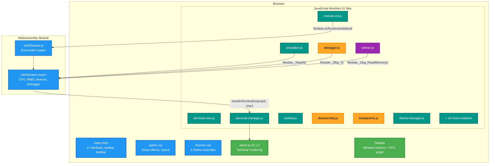
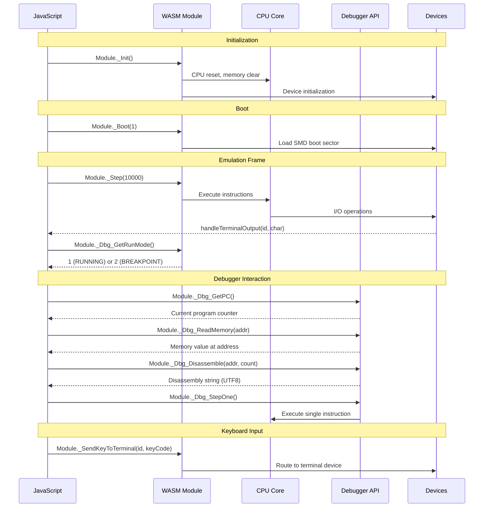

# Glass UI Architecture Reference

Comprehensive architecture documentation for the ND100X glassmorphism browser frontend (`template-glass/`).

> **Target audience**: Contributors modifying or extending the Glass UI.
> **Build & run**: `make wasm-glass` to build, `make wasm-glass-run` to build and serve on `localhost:8000`.

---

## Table of Contents

1. [Introduction](#introduction)
2. [Architecture Overview](#architecture-overview)
3. [Build Pipeline](#build-pipeline)
4. [Boot Sequence](#boot-sequence)
5. [Emulation Loop](#emulation-loop)
6. [Window Management](#window-management)
7. [Module Reference](#module-reference)
8. [Toolbar & Menus](#toolbar--menus)
9. [Terminal Integration](#terminal-integration)
10. [Debugger](#debugger)
11. [SINTRAN OS Detection & Inspectors](#sintran-os-detection--inspectors)
12. [Theme System](#theme-system)
13. [Data Flow: C to JS](#data-flow-c-to-js)
14. [CSS Architecture](#css-architecture)
15. [State Persistence](#state-persistence)
16. [Adding a New Window](#adding-a-new-window)
17. [WebSocket Terminal Bridge](#websocket-terminal-bridge)

---

## Introduction

The Glass UI is the primary browser frontend for the ND100X emulator. It provides a modern glassmorphism interface with:

- Draggable, resizable floating windows
- xterm.js VT100 terminal emulation
- Full CPU debugger (registers, memory, disassembly, breakpoints, watchpoints)
- SINTRAN III operating system introspection tools
- 5 switchable color themes
- CPU load graphing with 60-second scrolling history
- Hardware page table inspector

The UI runs entirely in the browser. The emulator core is compiled to WebAssembly via Emscripten, and all debugger/inspector functionality calls exported C functions through the WASM bridge.

---

## Architecture Overview



---

## Build Pipeline

`make wasm-glass` performs the following steps:

1. **TypeScript compile**: `npx tsc -p template-glass/ts/tsconfig.json` compiles terminal TypeScript sources to `template-glass/js/`. 4 TS files produce 4 JS files (terminal-core, terminal-manager, terminal-bridge, terminal-popout-app). Compiled JS is checked into git so devs without TypeScript can build.
2. **Emscripten compile**: `emcmake cmake` builds the C codebase into `build_wasm_glass/bin/nd100wasm.js` + `nd100wasm.wasm` with `DEBUGGER_ENABLED=ON` and 74 exported `Dbg_*` functions.
3. **Copy UI assets**: The Makefile copies the entire `template-glass/` tree into `build_wasm_glass/bin/`:
   - `index.html` (entry point)
   - `terminal-popout.html` (pop-out terminal window)
   - `css/styles.css`, `css/themes.css`
   - `js/*.js` (31 modules: 27 hand-written + 4 compiled from TypeScript)
   - `data/logical-device-numbers.json`
4. **Serve** (optional): `make wasm-glass-run` starts `python3 -m http.server 8000` in the build output directory.

The WASM binary and the UI assets are combined at build time, not at runtime. The browser loads `index.html` which references all JS/CSS files and the Emscripten-generated `nd100wasm.js` loader.

**Exported WASM functions** are defined in `src/frontend/nd100wasm/CMakeLists.txt` via the `EXPORTED_FUNCTIONS` linker flag. `UTF8ToString` is included in `EXPORTED_RUNTIME_METHODS` for C string returns.

---

## Boot Sequence

```mermaid
sequenceDiagram
    participant B as Browser
    participant MI as module-init.js
    participant WM as nd100wasm.js
    participant TM as theme-manager.js
    participant TC as terminal-core.js
    participant TM as terminal-manager.js
    participant E as emulation.js
    participant TB as toolbar.js
    participant U as User

    B->>MI: Load first (script tag line 9)
    Note over MI: Define global Module object<br/>with locateFile, print, printErr,<br/>onRuntimeInitialized callback
    B->>WM: Load nd100wasm.js (line 774)
    WM->>WM: Fetch and compile .wasm binary
    WM->>MI: Module.onRuntimeInitialized()
    MI->>MI: setupTerminalOutputHandler()
    MI->>MI: initializeSystem()
    MI->>MI: loadDiskImages() fetch SMD0.IMG via XHR
    MI->>TM: initializeTerminals()
    B->>TC: Load color themes, font options, factory functions
    B->>TM: Apply saved theme from localStorage
    B->>TB: Wire toolbar buttons and menus
    Note over U: User picks a machine (toolbar-machine-select)<br/>and clicks Power
    U->>TB: toolbar-power click
    Note over TB: ND-500 NDIX machine: ndix-machine.js<br/>creates, mounts the root disc, boots - no ND-100
    TB->>TB: preloadBootImage() - demo mode fetches the [boot] unit's image into MEMFS
    TB->>WM: Module._InitWithConfig(ini of the active machine)
    Note over TB: Start SINTRAN detection polling
    TB->>TM: initializeTerminals()
    TB->>TB: bootConfiguredMachine() - DescribeMachineINI says what [boot] device is
    TB->>WM: Module._BootFrom(type, unit, image)
    Note over TB: type: 0=floppy, 1=smd, 3=scsi, 4=winchester;<br/>device = none: powered on, nothing loaded
    TB->>E: startEmulation()
    E->>E: requestAnimationFrame(executeInstructionBatch)
    loop Every animation frame
        E->>WM: Module._Step(10000)
        E->>E: sampleCpuLoad()
        E->>E: Check Dbg_GetRunMode()
    end
```

### Script Load Order

Scripts load in this exact order (from `index.html`):

| Order | File | Purpose |
|-------|------|---------|
| 1 | `js/module-init.js` | Global `Module` object, disk loading, terminal output handler |
| 2 | `lib/xterm/xterm.min.js` (vendored 5.1.0, see `lib/xterm/README.md`) | Terminal rendering library |
| 3 | `lib/xterm/xterm-addon-fit.min.js`, `lib/xterm/xterm-addon-canvas.min.js` | Terminal auto-fit and canvas addons |
| 4 | `nd100wasm.js` | Emscripten-generated WASM loader |
| 4a | `js/emu-proxy-worker.js` OR `js/emu-proxy.js` | Emulation proxy (Worker or Direct mode, selected at runtime) |
| 5 | `js/smd-storage.js` | OPFS-based persistent SMD storage with UUID-keyed images |
| 6 | `js/drive-registry.js` | Unified drive mount state registry, Machine Info auto-update |
| 7 | `js/theme-manager.js` | Theme load/save/apply |
| 8 | `js/terminal-core.js` | Color themes, font scaling, terminal factory, keyboard handler (compiled from TS) |
| 9 | `js/terminal-manager.js` | Terminal creation, tabs, floating windows, settings (compiled from TS) |
| 10 | `js/terminal-bridge.js` | Pop-out terminal BroadcastChannel bridge (compiled from TS) |
| 11 | `js/emulation.js` | Main execution loop, CPU load sampling |
| 12 | `js/toolbar.js` | Window management, buttons, menus, dragging |
| 13 | `js/floppy-browser.js` | Floppy image library browser |
| 14 | `js/help-window.js` | SINTRAN command help with search |
| 15 | `js/debugger.js` | Debugger panel (registers, memory, flags, stepping) |
| 16 | `js/disassembly.js` | Standalone disassembly window |
| 17 | `js/breakpoints.js` | Breakpoint/watchpoint manager |
| 18 | `js/sintran.js` | OS detection polling and system info |
| 19 | `js/sintran-symbols.js` | Shared symbol tables and memory helpers |
| 20 | `js/sintran-rt-names.js` | RT program name reverse lookup |
| 21 | `js/sintran-processes.js` | Process list and detail windows |
| 22 | `js/sintran-queues.js` | Execution, time, monitor queue viewer |
| 23 | `js/sintran-seg-names.js` | System segment name lookup |
| 24 | `js/sintran-segments.js` | Segment table viewer |
| 24b | `js/smd-image-source.js` | Get mounted SMD image bytes (OPFS persistent or MEMFS non-persistent) |
| 24c | `js/sintran-initial-commands.js` | Initial Commands window (INIBU buffer decoded from SEGFIL0 in the SMD image) |
| 25 | `js/sintran-dev-names.js` | Device address-to-name tables |
| 26 | `js/sintran-devices.js` | I/O device inspector (4-phase discovery) |
| 27 | `js/pagetables.js` | Hardware page table inspector |
| 28 | `js/smd-manager.js` | SMD Disk Manager window (local library, catalog, gateway mounts) |
| 29 | `js/cpu-load-graph.js` | CPU load graph (scrolling 60s history) |

**Worker-only modules** (loaded by `emu-worker.js`, not in main page):

| File | Purpose |
|------|---------|
| `js/emu-worker.js` | Web Worker emulation loop, MessageChannel scheduling |
| `js/disk-io-worker.js` | Disk I/O sub-worker, SharedArrayBuffer + Atomics synchronous block R/W |

### Two-Phase Init/Boot

`Init()` and `Boot()` are deliberately separated in the WASM API:

- **`Module._Init()`** - Hardware initialization only: CPU reset, memory clear, device setup. Called when the user clicks Power On.
- **`Module._Boot(type)`** - Load boot sector from virtual filesystem. Called when the user clicks Boot.

This separation allows the UI to configure settings (e.g., select boot device, load disk images) between hardware init and boot.

---

## Emulation Loop

The main emulation loop lives in `emulation.js` and uses `requestAnimationFrame` for smooth 60fps execution:

```
executeInstructionBatch()
  |
  +-- Guard: if (!emulationRunning && !continuousStepMode) return
  +-- Module._Step(10000)           // Execute 10,000 instructions
  +-- sampleCpuLoad()               // Sample PIL for CPU utilization
  +-- mode = Module._Dbg_GetRunMode()
  |     |
  |     +-- mode === 2 (CPU_BREAKPOINT):
  |     |     Stop emulation, show debugger, update status
  |     |
  |     +-- mode === 1 (CPU_RUNNING):
  |           requestAnimationFrame(executeInstructionBatch)
  |
  +-- Update CPU load graph
```

### Key Constants

| Constant | Value | Location |
|----------|-------|----------|
| `instructionsPerFrame` | 10,000 | `emulation.js:45` |
| `CPU_LOAD_WINDOW` | 120 samples | `emulation.js:56` |
| `CPU_LOAD_DOM_INTERVAL` | 15 frames | `emulation.js:57` |

### CPU Load Sampling

Every frame, `sampleCpuLoad()` reads the current interrupt level via `Module._Dbg_GetPIL()`. PIL 0 = idle, any other level = busy. Samples are stored in a ring buffer and averaged to produce a percentage. The load value drives both the CPU Load Graph window and the taskbar mini graph.

### Two Mutually Exclusive Loops

The Glass UI has two execution loops that must never run simultaneously:

1. **Main loop** (`emulation.js` - `executeInstructionBatch`): Runs 10K instructions per frame at 60fps. Used during normal emulation.
2. **Debugger loop** (`debugger.js` - `dbgExecutionFrame`): Used for step operations and debugger-controlled execution.

When the debugger takes control (step, breakpoint hit), the main loop is stopped. When the user clicks Run in the debugger, the main loop resumes.

### Breakpoint Detection

After each `_Step()` call, `Dbg_GetRunMode()` is checked:
- `2` (`CPU_BREAKPOINT`) - Execution breakpoint hit. Stop reason checked via `Dbg_GetStopReason()`: value `8` = data watchpoint, value `2` = execution breakpoint.
- The emulation loop stops, the debugger window opens, and the breakpoint/disassembly views refresh.

---

## Window Management

All floating windows in the Glass UI share the same structure and behavior.

### Window Structure

Each window is a `<div class="glass-window">` with `position: fixed`:

```html
<div id="example-window" class="glass-window" style="display: none;">
  <div class="glass-window-header" id="example-header">
    <span>Window Title</span>
    <button class="glass-close-btn" id="example-close">x</button>
  </div>
  <div class="glass-window-body">
    <!-- content -->
  </div>
  <div class="resize-handle"></div>  <!-- optional -->
</div>
```

### Dragging

`makeDraggable(win, header, storageKey)` in `toolbar.js` makes a window draggable:

- **mousedown** on header: Record offset between mouse position and window corner
- **mousemove**: Update `left`/`top` style, constrained to viewport (min: `x=0, y=49` below toolbar; max: `innerWidth-100, innerHeight-60`)
- **mouseup**: Save position to localStorage

### Resizing

`makeResizable(win, handle, storageKey, minW, minH)` in `toolbar.js`:

- Corner grip in the resize handle
- Enforces minimum dimensions
- Saves width/height to localStorage

### Window Manager

The `windowManager` object in `toolbar.js` coordinates z-ordering and the taskbar:

```
windowManager = {
  zCounter: 7000,        // Increments per focus, resets at 8899
  windows: {},           // {id: {name, element}}
  focusedId: null,       // Currently focused window

  register(id, name)     // Add window, set initial z-index
  focus(id)              // Bring to front, update taskbar highlight
  updateTaskbar()        // Rebuild taskbar buttons for visible windows
  updateTaskbarActive()  // Highlight the focused window's button
}
```

Z-index range: 7000-8899 for windows, 8999 for dropdown menus.

### Taskbar

The taskbar at the bottom of the screen shows buttons for all visible windows. It is rebuilt every 500ms by `updateTaskbar()`, which:

1. Scans all registered windows for `display !== 'none'`
2. Compares against the previous set (avoids DOM thrashing if unchanged)
3. Creates a button per visible window
4. Click on a button: ensures window is visible, moves it into viewport if off-screen, focuses it

The taskbar also contains the CPU load mini-graph canvas (80x24px) and a settings button.

### Window Inventory

| Window ID | Default | Purpose |
|-----------|---------|---------|
| `machine-window` | Visible | Machine info, floppy drive status |
| `cpu-load-window` | Hidden | CPU utilization graph (resizable) |
| `terminal-window` | Visible | VT100 terminal (maximizable) |
| `about-window` | Hidden | About dialog |
| `config-window` | Hidden | Theme selector |
| `floppy-modal` | Hidden | Floppy image library browser |
| `products-modal` | Hidden | Product filter for floppy browser |
| `help-window` | Hidden | SINTRAN command help (resizable) |
| `debugger-window` | Hidden | CPU debugger panel |
| `disasm-window` | Hidden | Standalone disassembly (resizable) |
| `breakpoints-window` | Hidden | Breakpoint/watchpoint manager (resizable) |
| `sysinfo-window` | Hidden | SINTRAN system information |
| `process-list-window` | Hidden | RT process list (resizable) |
| `queue-viewer-window` | Hidden | Queue viewer: exec/time/monitor (resizable) |
| `segment-table-window` | Hidden | Segment table viewer (resizable) |
| `io-devices-window` | Hidden | I/O device inspector (resizable) |
| `page-table-window` | Hidden | Hardware page table viewer (resizable) |
| `smd-manager-window` | Hidden | SMD Disk Manager (local library, catalog, gateway, persistence) |

---

## Module Reference

| Module | File | Responsibility | Global API |
|--------|------|----------------|------------|
| Init | `module-init.js` | WASM `Module` object, disk loading, terminal output callback | `Module`, `terminals`, `loadDiskImage()`, `handleTerminalOutput()` |
| Theme | `theme-manager.js` | 5 themes, localStorage persistence | `window.setTheme()`, `window.getTheme()` |
| Terminal Core | `terminal-core.js` (from `ts/terminal-core.ts`) | Color themes, font options, terminal factory, font scaling, keyboard handler, settings | `createScaledTerminal()`, `fitTerminalScaled()`, `setupTerminalKeyHandler()`, `getTerminalSettings()`, `getOpaqueTheme()`, `terminalColorThemes`, `terminalFontOptions`, `terminalColorOptions` |
| Terminal Manager | `terminal-manager.js` (from `ts/terminal-manager.ts`) | Terminal creation, tabs, floating windows, settings UI, active terminal tracking | `initializeTerminals()`, `createTerminal()`, `sendKey()`, `switchTerminal()`, `switchTerminalMode()`, `updateTerminalSubmenu()` |
| Terminal Bridge | `terminal-bridge.js` (from `ts/terminal-bridge.ts`) | Pop-out terminal BroadcastChannel bridge, output buffering | `window.popOutTerminal()`, `window.popInTerminal()`, `window.isPoppedOut()`, `window.bufferPopoutOutput()`, `window.broadcastThemeChange()` |
| Emulation | `emulation.js` | Main execution loop, CPU load sampling, level bars | `startEmulation()`, `stopEmulation()`, `createLevelBars()` |
| Toolbar | `toolbar.js` | Window management, drag/resize, menus, machine selector, Power (= init + boot of the machine's `[boot]` device) | `makeDraggable()`, `makeResizable()`, `windowManager`, `bootConfiguredMachine()`, `refreshMachineSelect()` |
| NDIX machine | `ndix-machine.js` | A standalone ND-500 running NDIX as a machine kind: boots the root disc onto terminal 1, ttys onto terminals 2+ | `ndixMachine.powerOn()`, `ndixMachine.isSelected()` |
| Welcome + machine pages | `welcome.js` | The first-visit Welcome window (Help > Welcome; `nd100x-welcome-show`, default on) and the Help > Machines pages, both rendered from `data/machines.json` (one entry per built-in machine: card text, full page sections, sources; `[sN]`/`[eN]`/`[mN]` tags in the JSON are bookkeeping and never shown, `[unverified: ...]` marks are shown until confirmed) | `welcomeWindow.open()`, `welcomeWindow.openMachinePage(name)` |
| Machine profiles | `machine-profiles.js` | Named machines in localStorage: `nd100` (INI) or `nd500-ndix` kinds. The five built-in machines (ND-100, ND-5000, BSD 2.11, 500 NDIX-C, TSS - NORD TSS 3.0 on an MMS1 ND-100 with the CDC cartridge disc and swapping drum from `[runtime]`, booted with `[boot] device = cdc`; store v5) are read-only and always first - Clone one to change it. Per machine: terminal settings (`terminal()`), catalog floppies for the floppy drives (`floppies()`, fetched from the archive at power-on) and library images for the drives (`library()`, mounted at power-on - the machine is the master of its drives). Store v3 drops the pre-built-in leftovers on upgrade | `machineProfiles.ini()`, `.kind()`, `.ndix()`, `.terminal()`, `.floppies()`, `.library()`, `.isShipped()`, `.clone()`, `.create()`, `.createNdix()` |
| Machine form | `machine-form.js` | The Machine Setup form: CPU, ND-5000 box, controllers and disks, terminals, boot drive (enabled controllers only, or none). Disk slots: with persistent storage on, a dropdown of library images of the controller's type; in demo mode locked to the server's demo image names. Floppy slots also have an Archive... picker into the Norsk Data software archive | `machineForm.load()`, `.toINI()`, `.floppyPicks()`, `.libraryPicks()` |
| Floppy Browser | `floppy-browser.js` | Floppy image library, search, product filter, mount | `openFloppyBrowser()`, `closeFloppyBrowser()` |
| Help | `help-window.js` | SINTRAN command help, search, section navigation | `openHelpWindow()`, `closeHelpWindow()` |
| Debugger | `debugger.js` | Register display, memory view, flags, step controls | `window.dbgShowWindow()`, `window.dbgHideWindow()`, `window.dbgActivateBreakpoint()` |
| Disassembly | `disassembly.js` | Standalone disassembly window with breakpoint gutters | `window.disasmShowWindow()`, `window.disasmHideWindow()` |
| Breakpoints | `breakpoints.js` | Breakpoint/watchpoint list, add/remove UI | `window.bpShowWindow()`, `window.bpHideWindow()`, `window.bpRefresh()` |
| SINTRAN Core | `sintran.js` | OS detection polling, SYSEVAL read, system info display | `sintranStartDetection()`, `sintranState` |
| SINTRAN Symbols | `sintran-symbols.js` | Shared addresses, structure offsets, memory read helpers | `window.sintranSymbols` |
| RT Names | `sintran-rt-names.js` | RT program address-to-name reverse lookup | `window.resolveProcessName()` |
| Processes | `sintran-processes.js` | RT description table viewer, process detail | (internal show/hide) |
| Queues | `sintran-queues.js` | Execution, time, monitor queue viewer (3 tabs) | (internal show/hide) |
| Segment Names | `sintran-seg-names.js` | System segment number-to-name lookup | `window.segmentNames` |
| Segments | `sintran-segments.js` | Segment table viewer with flags and cross-references | (internal show/hide) |
| Device Names | `sintran-dev-names.js` | I/O device address-to-symbol lookup (K03/L07/M06) | `window.deviceNames` |
| Devices | `sintran-devices.js` | I/O device inspector (4-phase discovery, tabbed) | (internal show/hide) |
| Page Tables | `pagetables.js` | Hardware PTE viewer with decoded flags | `window.pageTableShowWindow()`, `window.pageTableHideWindow()` |
| CPU Load Graph | `cpu-load-graph.js` | Scrolling 60s CPU load graph, taskbar mini graph | `window.cpuLoadGraphPush()`, `window.cpuLoadGraphReset()` |
| SMD Storage | `smd-storage.js` | OPFS persistent storage layer: UUID-keyed images, metadata, unit assignments | `window.smdStorage` |
| Drive Registry | `drive-registry.js` | Unified mount state for all drives, onChange callbacks, Machine Info auto-update | `window.driveRegistry` |
| SMD Manager | `smd-manager.js` | Disk Manager window: local library, catalog copy, import/export, gateway mounts | `window.smdManagerShow()`, `window.smdManagerHide()` |
| Line Printer | `printer.js` | Line Printer output window, auto-scroll, 2000-line trim | `window.handlePrinterOutput()` |
| Paper Tape | `paper-tape.js` | Paper Tape reader upload and writer hex/ASCII display with download | `window.handlePaperTapeWriterOutput()` |
| Emu Proxy | `emu-proxy.js` | Direct mode: synchronous bridge from JS API to `Module._*()` calls | `window.emu` |
| Emu Proxy Worker | `emu-proxy-worker.js` | Worker mode: async bridge from JS API to Worker via `postMessage` | `window.emu` |
| Emu Worker | `emu-worker.js` | Worker: runs WASM, MessageChannel loop, terminal ring buffer drain | (Worker scope) |
| Disk I/O Worker | `disk-io-worker.js` | Sub-worker: synchronous disk block R/W via SharedArrayBuffer + gateway WebSocket | (Worker scope) |

---

## Toolbar & Menus

The toolbar is a sticky bar at the top of the viewport containing:

### Left Section
- ND100X logo and brand text

### Center Section - Dropdown Menus

**View Menu** (`menu-view`):
| Item | Action |
|------|--------|
| Machine Info | Toggle `machine-window` |
| CPU Load Graph | Toggle `cpu-load-window` |
| Floppy Library | Open floppy browser modal |
| Debugger | Toggle `debugger-window` via `dbgShowWindow()`/`dbgHideWindow()` |
| Disassembly | Toggle `disasm-window` via `disasmShowWindow()`/`disasmHideWindow()` |
| Breakpoints | Toggle `breakpoints-window` via `bpShowWindow()`/`bpHideWindow()` |
| Page Tables | Toggle `page-table-window` |
| SMD Disk Manager | Toggle `smd-manager-window` |
| Line Printer | Toggle `line-printer-window` |
| Paper Tape | Toggle `paper-tape-window` |

**SINTRAN Menu** (`sintran-menu-container`):
- Hidden by default, shown when SINTRAN is detected
- Items: System Info, Processes, Queues, Segments, I/O Devices

**Help Menu** (`menu-help`):
- SINTRAN Commands (opens help window)
- About (opens about window)

### Right Section

| Element | ID | Purpose |
|---------|----|---------|
| Status text | `status` | Shows "Ready", "Running", "Breakpoint hit", etc. |
| Machine selector | `toolbar-machine-select` | Which Machine Setup profile Power starts; locked while powered on |
| Power button | `toolbar-power` | Power on = build the machine and boot its `[boot]` device (off reloads the page). No separate Boot step: the boot drive is part of the machine (Machine Setup), `device = none` powers on with nothing loaded |
| Boot BPUN file | `menu-boot-bpun` (View menu) | Load a BPUN into a powered-on ND-100 through the hidden `bpun-file-input` |
| Reset button | `toolbar-reset` | Reset the emulator |

---

## Terminal Integration

### TypeScript Architecture

Terminal code is written in TypeScript (`template-glass/ts/`) and compiled to JavaScript (`template-glass/js/`). Three modules work together:

- **`terminal-core.ts`** - Single source of truth for color themes, font options, terminal factory, font scaling, keyboard handler, and settings management. Used by both the main page and pop-out windows.
- **`terminal-manager.ts`** - Main page terminal orchestration: console terminal, floating windows, tab switching, settings UI.
- **`terminal-bridge.ts`** - BroadcastChannel bridge for pop-out terminal windows.
- **`terminal-popout-app.ts`** - Pop-out window application (loaded in `terminal-popout.html`).

### xterm.js Setup

The terminal uses xterm.js v5.1.0 served from `template-glass/lib/xterm/` (the exact files cdn.jsdelivr.net used to serve; vendored 08-OCT-2026 because the `document.write` cross-site loads drew a Chrome warning and Edge "Tracking Prevention" lines on every page load), with the FitAddon for responsive sizing and CanvasAddon for precise rendering at all font sizes. Both pages load them with plain `<link>`/`<script>` tags that the Makefile cache-busts.

**Terminal creation** (`terminal-manager.ts` - `createTerminal()`):
- Creates a DOM container `terminal-container-{identCode}`
- Creates a tab button for multi-terminal switching
- Calls `createScaledTerminal()` from `terminal-core.ts` which:
  - Creates xterm.js instance with `cursorBlink: true`, `rows: 24`, `cols: 80`
  - Loads CanvasAddon (with fallback) and FitAddon
  - Attaches ResizeObserver for automatic refitting
  - Runs 3-phase font scaling via `fitTerminalScaled()`
- Stores reference in global `terminals[identCode]` object

### Responsive Font Sizing

Font size is computed dynamically by `fitTerminalScaled()` in `terminal-core.ts` using a 3-phase CSS zoom-aware algorithm:

1. **Phase 1 (Binary search)**: Create a DOM `<span>` with the target font, measure character width via `getBoundingClientRect()` (zoomed-aware). Binary search for the largest font size that fits 80 columns and 24 rows within the container.
2. **Phase 2 (proposeDimensions verification)**: Call xterm's `proposeDimensions()` to verify the fit. **Skipped under CSS zoom** because proposeDimensions mixes unzoomed container metrics with zoomed cell metrics.
3. **Phase 3 (Clipping check)**: Verify the terminal doesn't extend beyond screen height. Reduce font size if clipped.

### Keyboard Input Flow

```
User keypress -> setupTerminalKeyHandler() -> sendCallback(keyCode)
  -> sendKey() -> Module._SendKeyToTerminal(activeTerminalId, keyCode)
    -> C terminal device handler
```

The keyboard handler is created by `setupTerminalKeyHandler(term, sendCallback, isActiveCheck?)` in `terminal-core.ts`. The same factory is used for main page terminals (sends via `emu.sendKey`) and pop-out terminals (sends via `channel.postMessage`).

Special handling:
- **RAW_MODE**: All printable and control characters sent as-is
- **Ctrl+A..Z**: Mapped to control codes 1-26
- **LF (10)**: Converted to CR (13)
- **Backspace (8/127)**: Echo `\b \b` locally

### Font & Color Options

Canonical lists defined once in `terminal-core.ts` and exported as `window.terminalFontOptions` and `window.terminalColorOptions`. HTML select elements are built dynamically via `buildFontSelectHTML()` and `buildColorSelectHTML()`.

Fonts: `monospace`, `VT323`, `Fira Mono`, `IBM Plex Mono`, `Cascadia Mono`, `Source Code Pro`

Color themes (defined once in `terminalColorThemes`):

| Theme | Foreground | Background |
|-------|------------|------------|
| Green | `#00FF00` | transparent |
| Amber | `#FFBF00` | transparent |
| White | `#F8F8F8` | transparent |
| Blue | `#00BFFF` | transparent |
| Paperwhite | `#222222` | `#f0f0f5` |

Pop-out windows use `getOpaqueTheme()` which replaces transparent backgrounds with solid equivalents.

Settings are persisted in localStorage key `terminal-settings` via `getTerminalSettings()` and `saveTerminalSettings()` from `terminal-core.ts`.

### Terminal renderer, emulator and keyboard belong to the machine

Which renderer draws a machine's terminals (RetroTerm or xterm.js), which
terminal it emulates (TDV 2200, TDV 2215, VT100) and which national keyboard
it has are settings of the machine (Machine Setup › Terminal, stored by
`machineProfiles.terminal()`), not of the browser. `terminal-core.ts` asks
`currentTerminalSettings()` every time a terminal is created, and the console
is rebuilt when the machine selector changes, so there is no reload. Both
renderers are always loaded. An ND-100 machine defaults to RetroTerm's TDV
2200 (SINTRAN's terminal); an ND-500 NDIX machine is always the xterm.js
VT100 (`forceXterm`), because NDIX drives its console with ANSI/VT100 escapes
and RetroTerm ships only the TDV (`lib/retroterm/emulators/` holds `tdv` and
nothing else). The pop-out terminal page has no machine store and reads the
`nd100x-terminal-backend` / `nd100x-emulator-type` / `nd100x-keyboard-language`
keys, which `machine-profiles.js` keeps mirrored to the active machine.

**In the guest, set `TERM=vt131`.**

NDIX's `/.profile` sets `TERM=vt100`, and the `vt100` entry in the image's own
`/etc/termcap` is broken: it declares SS3 arrow keys (`ku=\EOA:kd=\EOB:kr=\EOC:kl=\EOD`)
but its `ks=\E=` is DECKPAM, which switches the numeric **keypad** only.
Nothing in `ks` or `is=` ever sends DECCKM (`\E[?1h`), so a correct VT100 stays
in normal cursor mode and sends `\E[A` while vi waits for `\EOA`. The symptom
is distinctive and misleading: **the screen renders perfectly and the arrow
keys do nothing**, because `cm`/`cd`/`ce` are plain CSI and work in either
mode. The commented-out "original" entry directly below it in the same file has
the correct `ks=\E[?1h\E=:ke=\E[?1l\E>` pair.

`vt131` (`D5|vt131|dt80|...`) is full ANSI VT100 rendering with normal-mode
arrows -- `ku=\E[A:kd=\E[B:kr=\E[C:kl=\E[D` -- which is exactly what xterm
sends. No edit to the image is needed:

```sh
TERM=vt131; export TERM
```

**If you want the TDV2200 instead, use `TERM=nd320`.**

The termcap has no entry named `tdv` or `tdv2200`. The TDV 2200 is in there as
`nd246` and `nd320`, whose `ku=^\ kd=^K kl=^H kr=^X kh=^]` match RetroTerm's
TDV2200 key table five-for-five. Prefer **`nd320`**: `nd246` addresses the
cursor with `cm=^P%.%.` (DLE), which RetroTerm only honours in TDV2115
compatibility mode, off by default, while `nd320` uses ANSI `\E[%i%d;%dH`.
`nd1200` is a different terminal -- its arrows are ANSI `\E[A` -- not the TDV.

| Console backend | `TERM` in NDIX |
|---|---|
| xterm.js (what the ND-500 window uses) | `vt131` |
| RetroTerm TDV2200 | `nd320` |
| -- | `vt100` is broken; arrows will not work |

---

## Debugger

The debugger panel (`debugger.js`) provides full CPU inspection and control.

### Register Display

Registers shown: `STS`, `P` (PC), `A`, `D`, `B`, `L`, `T`, `X`, `EA`

Element IDs: `dbg-r-{sts,p,a,d,b,l,t,x,ea}`

- Values displayed in octal
- Click any register to edit inline (octal input, commit on Enter or blur)
- Changed values flash with highlight for 600ms

### Step Controls

| Button | ID | WASM Function | Description |
|--------|----|---------------|-------------|
| Step In | `dbg-step` | `_Dbg_StepOne` | Execute one instruction |
| Step x10 | `dbg-step10` | `_Dbg_StepOne` x10 | Execute 10 instructions (stops early on breakpoint) |
| Step Over | `dbg-step-over` | `_Dbg_StepOver` | Step over subroutine calls |
| Step Out | `dbg-step-out` | `_Dbg_StepOut` | Run until current subroutine returns |
| Run | `dbg-run` | `_Dbg_SetPaused(0)` | Resume continuous execution |
| Pause | `dbg-pause` | `_Dbg_SetPaused(1)` | Pause execution |

### Keyboard Shortcuts

| Key | Action |
|-----|--------|
| F5 | Run/Pause toggle |
| F9 | Toggle breakpoint at current PC |
| F10 | Step Over |
| F11 | Step In |
| Shift+F11 | Step Out |

### Auto-Refresh

When the debugger window is visible, a 250ms timer calls `refreshView()` which dispatches to the active tab's renderer (registers, memory, disassembly, flags).

### Status Bar

Element `dbg-status` shows `RUNNING`, `PAUSED`, or `IDLE` with corresponding CSS class for color.

---

## SINTRAN OS Detection & Inspectors

### Detection Mechanism

`sintran.js` polls for SINTRAN III after power-on:

1. **Start**: `sintranStartDetection()` called after `Module._Init()`, starts a 2-second interval
2. **Poll**: Each tick reads SINVER at address `0x82D` (octal `004055`) via `Module._Dbg_ReadMemory()`
3. **Validate**: Extract version letter from low 7 bits (must be ASCII A-Z, range `0x41-0x5A`)
4. **OS type**: Extract from bits 10-8 (fallback: bits 14-12). Values: 0=VS, 1=VSE, 2=VSE/500, 3=RTP, 4=VSX, 5=VSX/500
5. **On detection**: Stop polling, set `sintranState.detected = true`, show SINTRAN menu

### SYSEVAL Table

12 words at octal addresses `004051-004064`, stable across all SINTRAN versions:

| Symbol | Address | Content |
|--------|---------|---------|
| SYSNO | `0x829` | System number |
| HWINFO0 | `0x82A` | CPU type + instruction set |
| HWINFO1 | `0x82B` | Microprogram version |
| HWINFO2 | `0x82C` | System type |
| SINVER0 | `0x82D` | Version letter + OS type |
| REVLEV | `0x82F` | Revision level |
| GENDAT0-4 | `0x830-0x834` | Generation date (min/hr/day/mon/yr) |
| UNAFLAG | `0x847` | System availability |

### Kernel Data Access

All SINTRAN inspector windows access kernel data through **DPIT** (Alternative Page Table #7). This is critical because kernel data resides in a different address space than user programs. The debugger's `Dbg_ReadPhysicalMemory()` and `Dbg_GetPageTableEntryRaw()` functions bypass the normal page table to read kernel structures.

### Inspector Windows

**System Info** (`sysinfo-window`): Displays SYSEVAL data, OS version string, hardware info.

**Process List** (`sintran-processes.js`): Reads the RT-Description table (22 words per entry). Shows process number, name (via `resolveProcessName()`), status flags, priority, segment assignments. Filterable by status. Click to see detail view with saved registers.

**Queue Viewer** (`sintran-queues.js`): Three tabs:
- **Execution Queue**: Circular linked list via WLINK field, ordered by priority
- **Time Queue**: Linked via TLINK, shows remaining time ticks
- **Monitor Queue**: I/O datafield chain via MQUEU head pointer

**Segment Table** (`sintran-segments.js`): Reads SGMAX segments from physical memory at `(SEGTB << 16) + SEGST`. 8 words per entry. Shows segment name (from `sintran-seg-names.js`), flags, physical addresses, RT cross-references.

**I/O Device Inspector** (`sintran-devices.js`): 4-phase discovery:
1. Symbol enumeration from `sintran-dev-names.js` tables
2. BRESL chain walk (enriches existing entries only)
3. MQUEU chain walk (enriches existing entries only)
4. R/W pair merge and category classification via GDEVTY/TYPRI

Tabbed by device category. 4-level filter: All / Configured / Initialized (default) / Active.

### RT Program Name Resolution

Program names are NOT stored in SINTRAN memory. `sintran-rt-names.js` provides reverse lookup tables built from linker symbol tables (SYMBOL-2-LIST) for K03, L07, and M06 versions. Background programs (BAKnn/BCHnn) are computed from terminal number ranges.

---

## Theme System

### Available Themes

| Theme | `data-theme` | Background | Glass | Accent |
|-------|-------------|------------|-------|--------|
| Dark (default) | (none) | `#0a0c1a` gradient | `rgba(12,16,35,0.85)` | Cyan |
| Light | `light` | `#e8ecf4` | `rgba(255,255,255,0.75)` | Blue |
| Amber | `amber` | `#0a0800` | `rgba(20,16,5,0.9)` | Amber |
| Nord | `nord` | `#2e3440` | `rgba(46,52,64,0.88)` | Frost cyan |
| Synthwave | `synthwave` | Purple gradient | `rgba(26,10,46,0.88)` | Hot pink |

### How It Works

`theme-manager.js` manages themes via the `data-theme` attribute on `<body>`:

- **Dark theme**: No `data-theme` attribute (CSS defaults)
- **Other themes**: `document.body.setAttribute('data-theme', name)`
- **Persistence**: `localStorage.getItem/setItem('nd100x-theme')`
- **Config window**: 5 theme cards with swatch previews, active card highlighted

`themes.css` contains `body[data-theme="NAME"]` blocks that override CSS custom properties defined as defaults in `styles.css`.

---

## Data Flow: C to JS



### Key WASM Bridge Functions

| Category | Function | Returns |
|----------|----------|---------|
| **Lifecycle** | `_Init()` | void |
| | `_Boot(type)` | void |
| | `_Step(count)` | void |
| | `_IsInitialized()` | bool |
| **CPU State** | `_Dbg_GetRunMode()` | 0-5 (CPURunMode enum) |
| | `_Dbg_GetPC()` | 16-bit address |
| | `_Dbg_GetPIL()` | 0-15 (interrupt level) |
| | `_Dbg_GetStopReason()` | Stop reason code |
| **Registers** | `_Dbg_GetRegister(level, reg)` | 16-bit value |
| | `_Dbg_SetRegister(level, reg, val)` | void |
| | `_Dbg_GetPCR(level)` | Page Control Register |
| **Memory** | `_Dbg_ReadMemory(addr)` | 16-bit value |
| | `_Dbg_ReadPhysicalMemory(addr)` | 16-bit value |
| | `_Dbg_Disassemble(addr, count)` | char* (UTF8) |
| **Breakpoints** | `_Dbg_AddBreakpoint(addr)` | void |
| | `_Dbg_RemoveBreakpoint(addr)` | void |
| | `_Dbg_GetBreakpointList()` | char* (UTF8) |
| | `_Dbg_AddWatchpoint(addr, type)` | void |
| | `_Dbg_RemoveWatchpoint(addr)` | void |
| **Stepping** | `_Dbg_StepOne()` | void |
| | `_Dbg_StepOver()` | void |
| | `_Dbg_StepOut()` | void |
| | `_Dbg_SetPaused(flag)` | void |
| **Page Tables** | `_Dbg_GetPageTableEntryRaw(pt, vpn)` | 32-bit PTE |
| | `_Dbg_GetPageTableCount()` | count |
| | `_Dbg_GetExtendedMode()` | bool |
| **Input** | `_SendKeyToTerminal(id, keyCode)` | void |

---

## CSS Architecture

### Glass Effect

The signature glassmorphism look comes from CSS `backdrop-filter`:

```css
.glass-window {
    background: rgba(color, 0.88);                     /* Semi-transparent */
    backdrop-filter: blur(16px) saturate(120%);         /* Glass blur */
    -webkit-backdrop-filter: blur(16px) saturate(120%); /* Safari */
    border: 1px solid rgba(255, 255, 255, 0.1);        /* Subtle border */
    border-radius: 12px;
    box-shadow: 0 8px 32px rgba(0, 0, 0, 0.3);
}
```

The toolbar uses stronger blur: `blur(24px) saturate(180%)`.

### File Split

- **`styles.css`**: All layout, glass effects, window styling, button styles, table styles, animations. Contains CSS custom property defaults for the dark theme.
- **`themes.css`**: `body[data-theme="NAME"]` override blocks for light, amber, nord, synthwave themes. Each block redefines the custom properties from `styles.css`.

### Background Effects

Three animated gradient orbs (`.bg-orb-1`, `.bg-orb-2`, `.bg-orb-3`) float behind all content, creating depth through the glass transparency.

### Z-Index Layers

| Range | Usage |
|-------|-------|
| 0-999 | Background effects |
| 1000 | Toolbar |
| 7000-8899 | Windows (managed by `windowManager.zCounter`) |
| 8999 | Dropdown menus |
| 9000+ | Loading overlay, modals |

---

## State Persistence

All UI state is persisted to `localStorage`:

### Window Positions

| Key | Format | Used By |
|-----|--------|---------|
| `term-pos` | `{left, top, width, height}` | Terminal window |
| `machine-pos` | `{left, top}` | Machine info |
| `dbg-pos` | `{left, top}` | Debugger |
| `disasm-pos` | `{left, top}` | Disassembly |
| `breakpoints-pos` | `{left, top}` | Breakpoints |
| `cpu-load-pos` | `{left, top}` | CPU load graph |
| `help-window-pos` | `{left, top}` | Help |
| `floppy-browser-pos` | `{left, top}` | Floppy browser |
| `sysinfo-pos` | `{left, top}` | System info |
| `proc-list-pos` | `{left, top}` | Process list |
| `queue-viewer-pos` | `{left, top}` | Queue viewer |
| `segment-table-pos` | `{left, top}` | Segment table |
| `io-devices-pos` | `{left, top}` | I/O devices |
| `page-table-pos` | `{left, top}` | Page table |
| `config-pos` | `{left, top}` | Config/theme window |

### Other State

| Key | Format | Purpose |
|-----|--------|---------|
| `window-visibility` | `{windowId: boolean}` | Which windows are open |
| `term-maximized` | `"0"` or `"1"` | Terminal maximize state |
| `terminal-settings` | `{identCode: {fontFamily, colorTheme}}` | Per-terminal font/color |
| `nd100x-theme` | Theme name string | Selected theme |
| `nd100x-worker` | `"true"` or absent | Web Worker emulation mode |
| `nd100x-ws-bridge` | `"true"` or absent | WebSocket terminal bridge enabled |
| `nd100x-ws-url` | URL string | Gateway WebSocket URL (default `ws://localhost:8765`) |
| `nd100x-smd-persist` | `"true"` or absent | SMD persistent storage enabled (OPFS mode) |
| `nd100x-smd-metadata` | JSON object | Image metadata keyed by UUID |
| `nd100x-smd-units` | JSON object `{0: uuid, ...}` | Unit-to-UUID assignments for persistent drives |
| `nd100x-smd-boot-unit` | `"0"`-`"3"` | Boot drive unit number |

---

## Adding a New Window

Step-by-step guide for contributors adding a new floating window to the Glass UI.

### 1. Add HTML in `index.html`

Add a new `<div class="glass-window">` block (typically before the taskbar):

```html
<div id="myfeature-window" class="glass-window" style="display: none; width: 500px; height: 400px; top: 150px; left: 200px;">
  <div class="glass-window-header" id="myfeature-header">
    <span>My Feature</span>
    <button class="glass-close-btn" id="myfeature-close">x</button>
  </div>
  <div class="glass-window-body">
    <!-- your content here -->
  </div>
  <div class="resize-handle" id="myfeature-resize"></div>
</div>
```

### 2. Create JS Module

Create `template-glass/js/myfeature.js` using the IIFE pattern:

```javascript
(function() {
  'use strict';

  var visible = false;
  var refreshTimer = null;

  function show() {
    visible = true;
    document.getElementById('myfeature-window').style.display = 'flex';
    render();
    startRefreshTimer();  // if auto-refresh needed
  }

  function hide() {
    visible = false;
    document.getElementById('myfeature-window').style.display = 'none';
    stopRefreshTimer();
  }

  function render() {
    // Update window content
  }

  function startRefreshTimer() {
    if (refreshTimer) return;
    refreshTimer = setInterval(function() {
      if (visible) render();
    }, 500);
  }

  function stopRefreshTimer() {
    if (refreshTimer) { clearInterval(refreshTimer); refreshTimer = null; }
  }

  // Close button
  document.getElementById('myfeature-close').addEventListener('click', hide);

  // Expose for toolbar.js
  window.myfeatureShowWindow = show;
  window.myfeatureHideWindow = hide;
})();
```

### 3. Add Script Tag in `index.html`

Add before `cpu-load-graph.js` (which must be last):

```html
<script src="js/myfeature.js"></script>
```

### 4. Register in `toolbar.js`

Add drag/resize setup and menu entry:

```javascript
// In toolbar.js initialization section
makeDraggable(
  document.getElementById('myfeature-window'),
  document.getElementById('myfeature-header'),
  'myfeature-pos'
);
makeResizable(
  document.getElementById('myfeature-window'),
  document.getElementById('myfeature-resize'),
  'myfeature-size', 300, 200
);
windowManager.register('myfeature-window', 'My Feature');
```

### 5. Add Menu Entry

Add a menu item in the appropriate dropdown (View, SINTRAN, or Help) in `index.html`:

```html
<button class="menu-item" id="menu-myfeature">My Feature</button>
```

Wire it in `toolbar.js`:

```javascript
document.getElementById('menu-myfeature').addEventListener('click', function() {
  var win = document.getElementById('myfeature-window');
  if (win.style.display === 'none') {
    window.myfeatureShowWindow();
  } else {
    window.myfeatureHideWindow();
  }
});
```

### 6. Update Build

No build changes needed - the Makefile copies all `template-glass/js/*.js` files automatically.

---

## WebSocket Terminal Bridge & Gateway

The gateway server bridges remote terminal access, disk block I/O, and HDLC frames between TCP clients and the WASM emulator running in a Web Worker. A single Node.js server handles all traffic over one WebSocket endpoint.

> **Requirement**: Worker mode must be active (`?worker=1` or Config toggle). The bridge is not available in direct mode.

### Architecture

```
Remote Terminal Client (PuTTY / telnet / raw TCP)
    | TCP port 5001 (raw bytes after menu selection)
    |
Gateway Server (Node.js: tools/nd100-gateway/)
    | Single HTTP + WebSocket server on port 8765
    | Serves static files with COOP/COEP headers
    | Also handles HDLC TCP ports and disk image files
    |
    +-- WebSocket conn 1: Main Worker (emu-worker.js)
    |     Terminal I/O (0x01/0x02), HDLC (0x10-0x12), control JSON
    |
    +-- WebSocket conn 2: Disk Sub-Worker (disk-io-worker.js)
          Disk block R/W (0x20-0x23) via SharedArrayBuffer + Atomics
```

The gateway accepts two WebSocket connections: the emulator Worker (first) and the disk I/O sub-worker (second). Additional connections are rejected. Multiple TCP clients connect to the terminal port and select a terminal from a numbered menu.

### Remote Terminal Devices

The gateway is offered **every terminal of the machine except the console** (`buildGatewayTerminalList()` in `emu-worker.js`): the machine's own terminals from the INI `[terminals]` list - each of which also has a window in the page - plus the gateway-only ones below. A gateway client bound to a window terminal shares it: the window mirrors the session, keys from either side reach the guest, and when the client disconnects the guest sees the carrier drop (hang-up); the next key typed in the window gives the terminal its carrier back. Gateway-only terminals have no window; their output goes to the gateway alone. A standalone ND-500 running NDIX (`ndix-machine.js`, no ND-100 Init) registers its ttys instead - `tty1 (NDIX)` .. `tty3 (NDIX)`, identCode = tty unit + 1, the mapping the page's windows use - and connects the bridge itself after its boot (`connectBridgeIfOn()`), since the Config window's auto-connect waits for an ND-100 Init; gateway input goes to `Nd500_SendInput(unit)`, tty output to the gateway while a client is bound (window mirroring). Until 08-OCT-2026 only the gateway-only set was offered, which left a guest whose kernel knows no terminal beyond 11 (BSD 2.11: `tty1-7` on TERMINAL 5-11, `bsd211_481/usr/src/sys/nd100/cons_mt.c`) unreachable through the gateway. Verified headless 08-OCT-2026: BSD 2.11 login on TERMINAL 5 through the gateway, window mirroring it.

When the user enables the WebSocket bridge, `EnableRemoteTerminals()` is called in the WASM module (before the boot, see `remoteTerminalsBeforeBoot()` in `toolbar.js`). This creates 8 additional gateway-only terminal devices using thumbwheels 12-19:

| Slot | Thumbwheel | Name | IdentCode (dec) | IdentCode (oct) |
|------|------------|------|------------------|------------------|
| 8 | 12 | TERMINAL 12 | 43 | 053 |
| 9 | 13 | TERMINAL 13 | 44 | 054 |
| 10 | 14 | TERMINAL 14 | 45 | 055 |
| 11 | 15 | TERMINAL 15 | 46 | 056 |
| 12 | 16 | TERMINAL 16 | 47 | 057 |
| 13 | 17 | TERMINAL 17 | 48 | 060 |
| 14 | 18 | TERMINAL 18 | 49 | 061 |
| 15 | 19 | TERMINAL 19 | 50 | 062 |

Slots 0-7 are the local terminals (console + TERMINAL 5-11). Together they fill `MAX_TERMINALS=16` exactly.

### Binary Frame Protocol

All WebSocket binary frames use the first byte as a type discriminator:

| Type | Direction | Description |
|------|-----------|-------------|
| `0x01` | Gateway -> Emulator | **term-input** -- keyboard bytes |
| `0x02` | Emulator -> Gateway | **term-output** -- display bytes |
| `0x10` | Gateway -> Emulator | **HDLC RX frame** -- data from TCP |
| `0x11` | Emulator -> Gateway | **HDLC TX frame** -- data to TCP |
| `0x12` | Gateway -> Emulator | **HDLC carrier status** |
| `0x20` | Disk Worker -> Gateway | **Block read request** |
| `0x21` | Gateway -> Disk Worker | **Block read response** |
| `0x22` | Disk Worker -> Gateway | **Block write request** |
| `0x23` | Gateway -> Disk Worker | **Block write ack** |

JSON text frames are used for infrequent control messages (`register`, `client-connected`, `client-disconnected`, `carrier`, `disk-list`).

Full protocol specification: `docs/GATEWAY-PROTOCOL.md`

### Gateway Server

**Location**: `tools/nd100-gateway/`

**Files:**
- `gateway.js` -- Main server (HTTP + WebSocket + TCP + disk I/O + ethernet segments)
- `gateway.conf.json` -- Default configuration
- `package.json` -- Dependencies (ws library)
- `README.md` -- Running it, config keys, the tests
- `test-gateway.js` -- 14 unit tests
- `test-ethernet.js` -- 13 ethernet segment tests
- `test-eth-wasm.js` -- 17 ND-500 ethernet export tests (needs a wasm build)

**Configuration** (`gateway.conf.json`):

```json
{
  "websocket": { "port": 8765 },
  "staticDir": "",
  "terminals": { "port": 5001, "welcome": "ND-100/CX Terminal Server" },
  "hdlc": [
    { "name": "HDLC-0", "channel": 0, "port": 5010, "enabled": false },
    { "name": "HDLC-1", "channel": 1, "port": 5011, "enabled": false }
  ],
  "smd": {
    "images": [
      { "path": "../../SMD0.IMG", "name": "SINTRAN K", "description": "Standard system disk" },
      "../../SMD1.IMG"
    ]
  },
  "floppy": { "images": ["../../FLOPPY.IMG"] }
}
```

Disk image entries support two formats: a string path (`"../../SMD1.IMG"`) or an object `{ path, name, description }`. Object entries provide metadata for the dynamic `/smd-catalog.json` HTTP endpoint and the Glass UI Disk Manager. The index in the array is the unit number. The gateway opens images with `fs.openSync('r+')` for synchronous read/write.

**Running:**
```bash
make gateway              # Start gateway with default config
make gateway-test         # Run 14 unit tests
make wasm-glass-gateway   # Build Glass UI + start unified gateway server
```

The `wasm-glass-gateway` target serves the WASM build on `http://localhost:8765/?worker=1` with COOP/COEP headers enabling SharedArrayBuffer.

Custom config: `node tools/nd100-gateway/gateway.js --config path/to/config.json --static build_wasm_glass/bin`

**TCP Client Flow:**
1. Client connects to terminal port (default 5001)
2. Gateway sends welcome banner + numbered terminal menu
3. Client sends terminal number (e.g., `1` for first terminal)
4. Gateway binds the TCP socket to that terminal's identCode
5. Raw byte pass-through from this point
6. TCP disconnect sends `client-disconnected` to Worker, which sets carrier missing

### Disk I/O Sub-Worker

**File**: `template-glass/js/disk-io-worker.js`

The disk sub-worker enables synchronous disk block I/O from C code over an async WebSocket. The main Worker is blocked by `Atomics.wait()` during disk operations; the sub-worker's event loop remains free to process WebSocket messages and signal completion via `Atomics.notify()`.

**SharedArrayBuffer layout** (65568 bytes = 32 control + 64 KB data):

| Offset | Type | Purpose |
|--------|------|---------|
| 0 | Int32 | Control: 0=idle, 1=request pending, 2=response ready |
| 4-28 | Int32[6] | driveType, unit, offset, size, status, dataLen, isWrite |
| 32+ | Uint8[65536] | Data area (read response / write payload) |

The main Worker spawns the sub-worker and passes the SharedArrayBuffer. Both connect to the same gateway WebSocket endpoint. Remote disk images appear in the SMD Disk Manager "Remote Images" section.

### Worker Integration

**Output routing** in `emu-worker.js`:

The Worker's `runLoop()` drains the terminal ring buffer after each `Step()` batch. Each output entry's identCode is checked against `_remoteIdentCodes`:
- **Remote identCode**: Bytes batched into `wsOutBuf[identCode]` and sent as binary term-output (0x02) once per frame (~60/sec)
- **Local identCode**: Sent to main thread via `postMessage` as before

HDLC TX frames are polled after terminal output and sent as binary frames (0x11) over the same WebSocket.

**Input path**: Gateway sends binary term-input (0x01) over WebSocket. The Worker calls `Module._SendKeyToTerminal(identCode, byte)` for each byte. HDLC RX frames (0x10) are injected via `Module._HDLC_InjectRxFrame()`.

### Glass UI Config

The Config window contains a "Network" section (visible only in Worker mode):

| Element | ID | Purpose |
|---------|----|---------|
| Toggle | `config-ws-bridge` | Enable/disable WebSocket terminal bridge |
| URL input | `config-ws-url` | Gateway WebSocket URL |
| Status | `config-ws-status` | Connection status (Connected/Disconnected) |

The toggle persists to `localStorage` key `nd100x-ws-bridge`. When enabled, the bridge auto-connects on page load after the emulator is ready (polls `emu.isReady()` every 1 second, up to 30 seconds).

The SMD Disk Manager window shows a "Remote Images (Gateway)" section when the disk sub-worker is connected, listing available SMD and floppy images with mount/eject controls.

### Drive Registry

`drive-registry.js` is the single source of truth for all drive mount state in the UI. All modules call `driveRegistry.mount()` / `driveRegistry.eject()` instead of maintaining their own state. The Machine Info window updates automatically via an `onChange` listener.

**API:**

| Method | Description |
|--------|-------------|
| `mount(type, unit, source, name, fileName, imageSize)` | Register a mount. Auto-ejects duplicates. |
| `eject(type, unit)` | Clear mount state. Caller handles WASM unmount. |
| `get(type, unit)` | Returns a copy of mount entry: `{ mounted, source, name, fileName, imageSize }` |
| `getAll()` | Returns flat array of all drive entries. |
| `isOccupied(type, unit)` | Quick check if a slot is mounted. |
| `findByFileName(type, fileName)` | Find unit where a fileName is mounted (-1 if not found). |
| `onChange(callback)` | Subscribe to mount/eject events. Callback: `function(type, unit, action)` |
| `syncFromBackend()` | Sync registry from C backend state via `emu.getDriveInfo()`. |

**Source types:** `'demo'` (XHR to MEMFS), `'opfs'` (persistent storage), `'gateway'` (remote block I/O), `'library'` (floppy library).

### SMD Persistent Storage

`smd-storage.js` manages OPFS-based persistent disk images with UUID-keyed filenames. Images are stored in the browser's Origin Private File System, surviving page reloads. Metadata (name, description, size, date, source) is persisted in `localStorage` key `nd100x-smd-metadata`.

**Key concepts:**

- **UUID filenames**: Each image in OPFS has a UUID filename (e.g., `a3b2c1d0-...`). This avoids naming conflicts.
- **Unit assignments**: `localStorage` key `nd100x-smd-units` maps unit numbers (0-3) to UUIDs.
- **Worker mode**: Uses `SyncAccessHandle` for true per-block persistence (writes survive immediately).
- **Direct mode**: Loads entire image into memory buffer, auto-saves to OPFS on stop/unload.
- **Persistence toggle**: Config window toggle writes `nd100x-smd-persist` to `localStorage`, requires reload.

**HDD Disk Manager window** (`smd-manager.js`, markup `smd-manager-window` in `index.html`) provides the UI for:

- **Disk-type tabs**: SMD, SCSI, Winchester, NDIX, CDC - one tab per library disk type (`HDD_TAB_DISK_TYPE`, `hddSelectTab`). Each tab shows "(n)", the number of library images of its type (`hddUpdateTabCounts`). Library records carry a `diskType` tag: `smd`, `scsi`, `winchester` (controller types, from `disk-types.js`), `nd500` (an NDIX root disc, chosen in Machine Setup) and `cdc` (the NORD TSS CDC 9427 cartridge disc, 4 MB images such as `TSS-CDC.IMG`, the emulator's `[runtime] cdc = FILE` device). `nd500` and `cdc` are library-only tags, not controller units; their labels live in `EXTRA_DISK_TYPE_LABELS` in `smd-manager.js`
- **Local Disk Library** (per tab): list, import (the tab's type is preselected in the "Tag Imported Disk" dialog), rename, export, delete. NDFS (the SINTRAN file-system viewer) is offered on the SMD, SCSI and Winchester tabs only - an NDIX root disc is a Unix file system and a CDC cartridge disc carries the TSS file system. No Assign: a drive gets its image in Machine Setup
- **Type badge**: every list row carries a coloured `.smd-type-badge` for its type (`smdTypeBadgeHTML`): SMD blue, SCSI orange, Winchester purple, floppy green, ND5 red, CDC teal
- **Server Catalog**: Browse and copy `disk-catalog.json` entries into the local library, filtered to the active tab's type; a copy lands on the tab of its type
- **Remote Images**: Mount/eject gateway disk images (visible when gateway connected), filtered to the active tab's type

### Testing

Four test suites verify the bridge:

| Suite | File | Tests | Command |
|-------|------|-------|---------|
| Gateway unit tests | `tools/nd100-gateway/test-gateway.js` | 14 | `make gateway-test` |
| Ethernet segment | `tools/nd100-gateway/test-ethernet.js` | 13 | `make gateway-test` |
| ND-500 ethernet exports | `tools/nd100-gateway/test-eth-wasm.js` | 17 | `make gateway-test-wasm` |
| Browser integration | `test-gateway-browser.js` | 10 | `node test-gateway-browser.js` |

**Gateway unit tests** verify: server start, WebSocket connect/reject (2 allowed, 3rd rejected), TCP banner, terminal registration, menu selection, byte forwarding (both directions), disconnect handling, reconnection, and menu refresh.

**Ethernet segment tests** start their own gateway and join it as ordinary RETH clients over TCP -- no emulator, no browser. They use **three** members, not two: a segment built the way HDLC is (one socket per channel rather than a set per segment) works perfectly with two machines and silently drops the third. They also check that a frame is never echoed back to the member that sent it.

**ND-500 ethernet export tests** load the built emscripten module under node and call the `Nd500_Eth_*` exports directly, checking they exist, are reachable through `Module._name`, and refuse politely before a machine exists instead of faulting. They do not prove frames reach NDIX -- that needs a booted guest.

**Browser integration tests** (Puppeteer) verify the full stack: Worker mode page load, Network config visibility, proxy methods, power-on + remote terminal enablement, gateway registration via TCP menu, terminal selection, TCP-to-WASM input, output path, WebSocket status UI, and disconnect handling.
