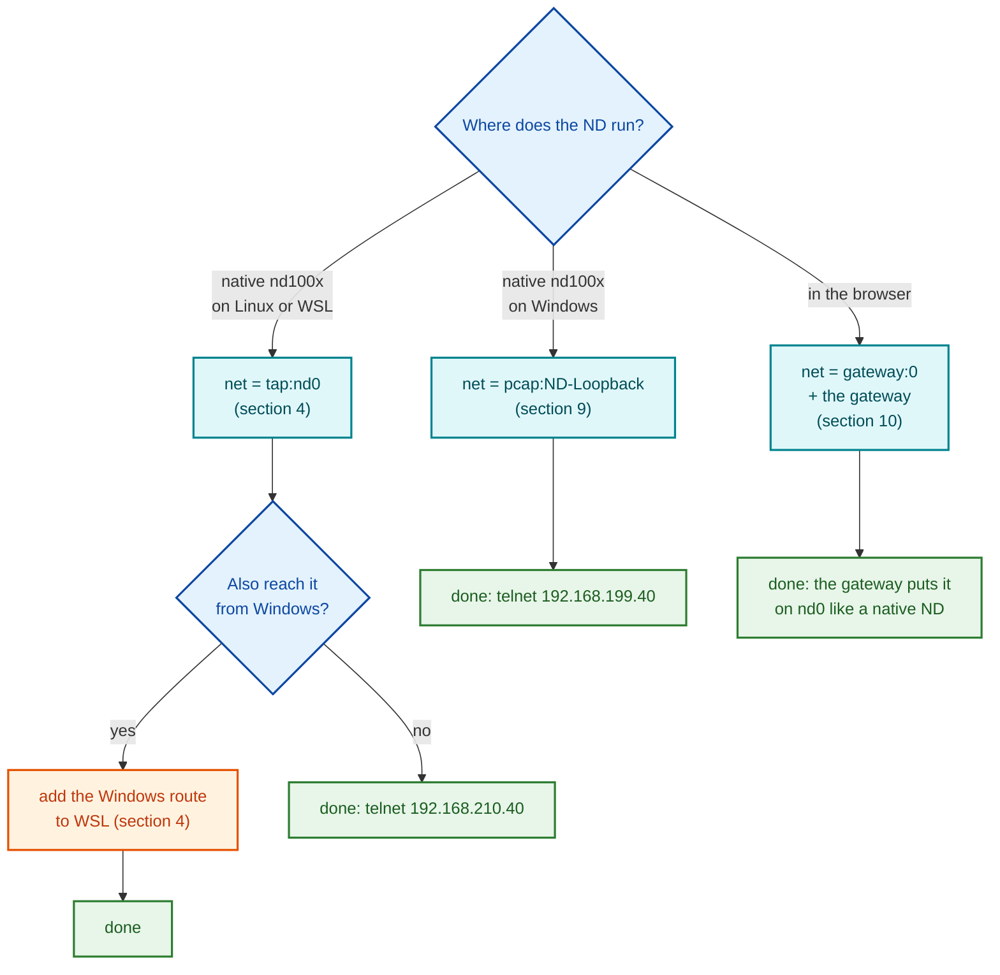
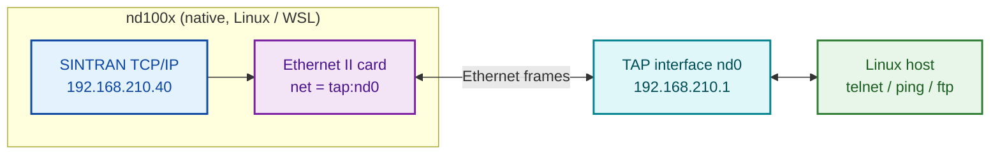
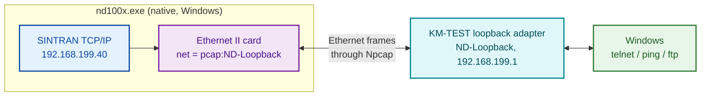
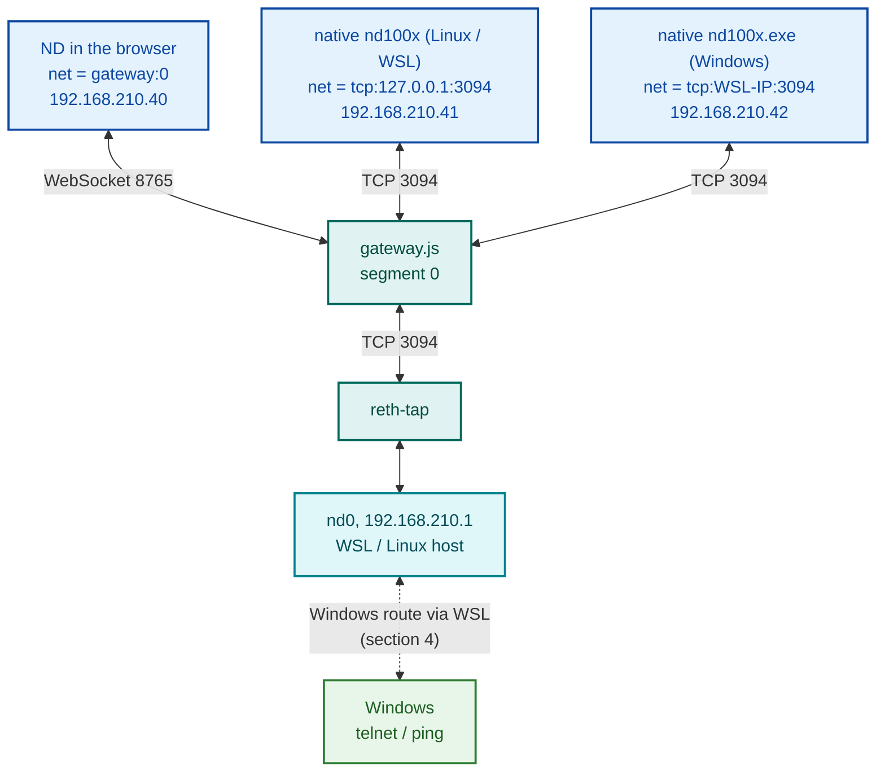
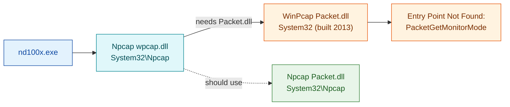

# Ethernet II controller

nd100x emulates the Norsk Data Ethernet II controller (PCB 3094, ND-110063):
an ND-100 bus card with its own MC68000, an MFP 68901 and an Am7990 LANCE.
The 68000 runs the card's own firmware, loaded by SINTRAN; the emulator
connects the LANCE's wire side to a host network.

This document covers:

0. [Start here: which setup do I need?](#start-here-which-setup-do-i-need)
1. [The card on the ND-100 bus](#1-the-card-on-the-nd-100-bus)
2. [Configuring the card (command line and INI)](#2-configuring-the-card)
3. [Host network backends](#3-host-network-backends)
4. [Linux: reaching the ND directly with TAP](#4-linux-reaching-the-nd-directly-with-tap)
5. [SINTRAN with COSMOS TCP/IP: what to edit in the disc image](#5-sintran-with-cosmos-tcpip-what-to-edit-in-the-disc-image)
6. [Checking that it works](#6-checking-that-it-works)
7. [SINTRAN without TCP/IP: COSMOS over Ethernet](#7-sintran-without-tcpip-cosmos-over-ethernet)
8. [Limits of this version](#8-limits-of-this-version)
9. [Windows: the card on a host adapter with Npcap (`pcap:`)](#9-windows-the-card-on-a-host-adapter-with-npcap-pcap)
10. [Browser (WebAssembly): network through the gateway](#10-browser-webassembly-network-through-the-gateway)
11. [Several native nd100x on one subnet without the gateway](#11-several-native-nd100x-on-one-subnet-without-the-gateway)
12. [FAQ](#12-faq)

Every fact below that was measured says so and gives the date. Port details
and the evidence for each part of the card are in
`docs/ETHERNET-II-PORT-PLAN.md` and `docs/ethernet-port/PHASE-LOG.md`.

---

## Start here: which setup do I need?

The emulated ND talks to the outside world through a **host network
backend**: the `net =` line of the card in the INI (or `--eth0=` on the
command line). Pick the backend from **where nd100x runs** and **who must
reach the ND**. Most people need only the first or second picture below.

**The gateway is only for the browser.** A native nd100x (Linux, WSL or
Windows) that just has to be reached with telnet, ping or ftp does NOT need
the gateway: it opens the host network itself, with `tap:` on Linux or
`pcap:` on Windows.



### Picture 1 - native nd100x on Linux / WSL: no gateway

nd100x opens the TAP interface `nd0` itself. Linux sees the ND as a machine
on a cable plugged into `nd0`.



### Picture 2 - native nd100x on Windows: no gateway

nd100x opens the KM-TEST loopback adapter through Npcap. Windows sees the
ND as a machine on that adapter.



### Picture 3 - the ND in the browser: the gateway carries the frames

A web page cannot open a TAP interface or a network adapter. So the
browser's card sends its frames over the page's WebSocket to the gateway
(`tools/nd100-gateway/gateway.js`, running in WSL or on Linux), and the
gateway puts them on `nd0` for it, through `reth-tap`, which it starts
itself.

```mermaid
flowchart LR
    subgraph BR["Browser"]
        SIN["SINTRAN TCP/IP<br/>192.168.210.40"] --> CARD["Ethernet II card<br/>net = gateway:0"]
    end
    CARD <-->|"WebSocket<br/>port 8765"| GW["gateway.js<br/>Ethernet segment 0"]
    GW <-->|"RETH, port 3094"| RT["reth-tap<br/>(started by the gateway)"]
    RT <--> TAP["TAP interface nd0<br/>192.168.210.1"]
    TAP <--> HOST["Linux / WSL host<br/>telnet / ping / ftp"]
    classDef blue fill:#E3F2FD,stroke:#0D47A1,stroke-width:2px,color:#0D47A1
    classDef teal fill:#E0F7FA,stroke:#00838F,stroke-width:2px,color:#004D57
    classDef green fill:#E8F5E9,stroke:#2E7D32,stroke-width:2px,color:#1B5E20
    classDef purple fill:#F3E5F5,stroke:#7B1FA2,stroke-width:2px,color:#4A148C
    classDef orange fill:#FFF3E0,stroke:#E65100,stroke-width:2px,color:#BF360C
    classDef darkteal fill:#E0F2F1,stroke:#00695C,stroke-width:2px,color:#004D40
    class SIN blue
    class CARD purple
    class GW,RT darkteal
    class TAP teal
    class HOST green
```



### Picture 4 - several machines on one network through the gateway

Port 3094 is the gateway's door for everything that is NOT the browser page:
other native nd100x, RetroCore, and `reth-tap`. Everything connected to
segment 0 hears every frame, like machines on one Ethernet cable. Each ND
needs its own IP address and its own CPU number (the CPU number sets the
MAC address).



### The words used in this document

| Word | Meaning |
|------|---------|
| **backend** | how the card's wire is connected on the host: the value of `net =` |
| **TAP interface** (`nd0`) | a virtual network card in Linux; nd100x plugs the ND into it (Linux only) |
| **Npcap** | the Windows driver that lets a program send and receive raw Ethernet frames on an adapter |
| **KM-TEST loopback adapter** | a virtual network card that ships with Windows; gives Windows a "cable" to the ND |
| **gateway** | `tools/nd100-gateway/gateway.js`, a Node program; the browser page's link to the host (terminals, disks, HDLC, Ethernet) |
| **segment** | one virtual Ethernet cable inside the gateway; everything on segment 0 hears everything else on it |
| **RETH, port 3094** | the gateway's TCP protocol for joining a segment from outside the browser |
| **reth-tap** | the small program that connects a gateway segment to `nd0`; the gateway starts it itself |

---


## 1. The card on the ND-100 bus

The thumbwheel on the card (12J) selects the IOX block and IDENT code. Source:
`eth_create_device_strap` in `src/devices/ethernet/device_ethernet.c`.

| Thumbwheel | IOX (octal)     | IDENT (octal) | Level |
|-----------:|-----------------|--------------:|------:|
| 0          | 140360 - 140363 | 140034        | 12    |
| 1          | 140364 - 140367 | 140035        | 12    |
| 2          | 140370 - 140373 | 140036        | 12    |
| 3          | 140374 - 140377 | 140037        | 12    |

The card has 512 KB of DRAM that the ND-100 also sees, through a window in
ND-100 physical memory. The window's bank is set by a strap (7J/9J):

- default bank = 16 + 4 x thumbwheel, so thumbwheel 0 is bank 16 =
  ND-100 byte address 0x200000;
- the window REPLACES local memory at that address: on a 4 MB machine TPE
  CONFIGURATION shows banks 020-023 as "Ether" and local memory as
  3.512 MB (measured 10-OCT-2026).

---

## 2. Configuring the card

Every option exists as a command-line flag and as an INI key; the command
line wins.

| Command line        | INI key in `[controller.eth.N]` | Meaning |
|---------------------|---------------------------------|---------|
| `--eth0=SPEC`       | `net = SPEC`                    | Adds the card (thumbwheel 0) and names its host network, see section 3 |
| `--eth0-bank=N`     | `bank = N`                      | DRAM window bank, 0-252, multiple of 4; omitted = 16 + 4 x thumbwheel |
| `--eth0-trace=FILE` | `trace = FILE`                  | Differential trace of the card (for comparing with RetroCore) |

Naming the section adds the card; `enabled = no` leaves it out.

INI example (`nd100-eth.ini` in the repository root is a complete machine):

```ini
[controller.eth.0]
enabled = yes
net = tap:nd0
# bank = 16
# trace = eth-trace.txt
```

`nd100x --config nd100-eth.ini --show-config` prints the card as it was
understood, for example:

```
eth     wheel 0  IOX 0140360-0140363  enabled
    net tap:nd0, bank 16 (default)
```

---

## 3. Host network backends

| SPEC | What it does | Reaches |
|------|--------------|---------|
| `none` | Card runs, sent frames are dropped, nothing is received | nothing |
| `tap:IFNAME` | Linux TAP interface (section 4) | the Linux host's own IP stack: ping, telnet, ftp from the host |
| `pcap:ADAPTER` | Windows host adapter through Npcap (section 9); `pcap:list` lists adapters | the Windows PC (KM-TEST loopback adapter) or the LAN (real adapter) |
| `udp` | UDP multicast segment, group 239.3.9.4, port 3094 | other nd100x and RetroCore cards on the same group |
| `udp:PORT`, `udp:GROUP`, `udp:GROUP:PORT` | same, other group or port | same |
| `listen`, `listen:PORT` | TCP link, waits for one peer (default port 3094; 0 = the OS picks) | one peer emulator |
| `tcp:HOST`, `tcp:HOST:PORT`, `HOST:PORT` | TCP link, connects to a peer, redials if it drops | one peer emulator |

The `udp` and TCP forms use RetroCore's wire formats, so an nd100x card and a
RetroCore card can be on the same segment:

- UDP: one Ethernet frame (no FCS) per datagram; multicast loopback is on,
  so several emulators on one host see each other;
- TCP: each side first sends the five bytes `R E T H 01`, then every frame as
  a 2-byte big-endian length followed by the frame.

What the emulator does to frames between the host and the card (same as
RetroCore):

- a received frame whose source MAC is the card's own is dropped (the echo of
  its own transmission);
- IPv4 / TCP / UDP checksums that do not verify are recomputed (a host with
  checksum offload sends them unfinished); frames that verify are not touched;
- frames shorter than 60 bytes are padded to 60, as a real segment would
  deliver them (SINTRAN ignores shorter ARP replies - measured by RetroCore).

`pcap:` is Windows only; `tap:` is Linux only. The browser build uses
`gateway:` (section 10).

---

## 4. Linux: reaching the ND directly with TAP

A TAP interface is a virtual Ethernet adapter on the Linux host. The card
sends its frames into it and the host answers as if the ND were on a cable
plugged into it.

### Create the interface once (needs root)

```sh
sudo ip tuntap add dev nd0 mode tap user $USER
sudo ip addr add 192.168.210.1/24 dev nd0
sudo ip link set nd0 up
```

`user $USER` makes the interface yours, so nd100x itself runs without root.
The interface stays until reboot (or `sudo ip tuntap del dev nd0 mode tap`).
Until nd100x opens it, `ip link` shows it as `NO-CARRIER ... DOWN`; that is
normal.

### Choose a subnet that is not used anywhere else

The host side (`192.168.210.1` above) and the ND (`192.168.210.40` in
section 5) must be on a subnet no other interface of the host, or of Windows
when running under WSL, already uses. Check with `ip -4 addr` (Linux) and
`ipconfig` (Windows). 192.168.210.0/24 was free on the machine this was
written on; 192.168.199.0/24 there belongs to the Windows "ND-Loopback"
adapter RetroCore uses.

### Under WSL2: reaching the ND from Windows

With WSL's default NAT networking, `nd0` lives inside WSL. Linux programs
in WSL reach the ND directly. Windows has no route to 192.168.210.0/24
until two things are set. Measured 10-OCT-2026: after both steps, Windows
telnets to the ND in the browser (gateway with TAP `nd0`).

1. WSL forwards packets between Windows and `nd0`:
   ```sh
   sudo sysctl -w net.ipv4.ip_forward=1
   ```
2. Windows sends 192.168.210.x to WSL. Find WSL's address with
   `ip -4 -br addr show eth0` in WSL (for example `172.24.50.23`), then in
   an administrator `cmd`:
   ```
   route add 192.168.210.0 mask 255.255.255.0 172.24.50.23
   ```

Replies need nothing extra: the ND's IP gateway is 192.168.210.1 (the
AIP-CONFIG line in section 5), which is WSL, and WSL's default route goes
back to Windows.

### Keeping it working after a restart

None of the steps above survive a WSL restart or a Windows reboot (`wsl
--shutdown`, Windows update, ...):

| Lost on | What | Restore |
|---------|------|---------|
| WSL restart | `nd0` and its address | the three `ip` commands in "Create the interface once" |
| WSL restart | forwarding | `sudo sysctl -w net.ipv4.ip_forward=1`, or once for good: `echo net.ipv4.ip_forward=1 \| sudo tee /etc/sysctl.d/99-nd100x.conf` |
| WSL restart | WSL's address (NAT gives a new one) | the Windows route, with the new address |
| Windows reboot | the Windows route | the Windows route |

The Windows route cannot be made permanent with `route -p`, because the
WSL address it points at changes. Instead re-add it with the current
address, from an administrator PowerShell, after WSL has started (these
three lines have not been run yet):

```powershell
$wsl = (wsl -e sh -c "ip -4 -br addr show eth0").Split(' ',[StringSplitOptions]::RemoveEmptyEntries)[2].Split('/')[0]
route delete 192.168.210.0 2>$null
route add 192.168.210.0 mask 255.255.255.0 $wsl
```

Run order after a restart: WSL commands first (`nd0`, forwarding), then the
PowerShell lines on Windows, then the gateway or nd100x.

---

## 5. SINTRAN with COSMOS TCP/IP: what to edit in the disc image

The COSMOS TCP/IP gateway (ND-211185) takes the ND's own address from two
text files on user SYSTEM. Both must agree; the comment at the top of
AIP-CONFIG says so itself ("The Internet address must be updated in the
AIP-HOSTS:SYMB too"). The controller must be restarted - in practice: boot
again - before a change takes effect.

### (SYSTEM)AIP-CONFIG:SYMB

One line per TCP/IP controller:

```
# TCP number    E-II number    IP address    IP gateway    Subnet bits
0              0              192.168.210.40 192.168.210.001  0
```

- TCP number: the TCP/IP controller number, 0 for the first;
- E-II number: the Ethernet II card number, 0 for the first;
- IP address: the ND's address;
- IP gateway: where packets for other networks go; on a TAP setup, the host
  side of the interface;
- Subnet bits: 0 on the image used here.

### (SYSTEM)AIP-HOSTS:SYMB

Name table, one host per line: address, then names:

```
192.168.210.40     c3          C3
192.168.210.1      host        HOST
```

The line for the ND's own address must match AIP-CONFIG.

### Other AIP files

`AIP-NETWORKS`, `AIP-PROTOCOL` and `AIP-SERVICES` are the usual name tables
and hold no address of this machine. `AIP-RESOLVER` names the DNS server
(`NAMESERVER`); change it only if the ND should resolve names through DNS.

To find every file holding an address before changing anything, extract all
text files and search them:

```sh
mkdir -p ndtext
ndtool -x -p -d -F '*:SYMB' -o ndtext DISC.IMG
ndtool -x -p -d -F '*:MODE' -o ndtext DISC.IMG
grep -rl '192\.168' ndtext
```

### Editing with ndtool (emulator stopped)

nd100x must NOT be running on the image while ndtool writes to it.

```sh
cp DISC.IMG DISC.IMG.orig                                  # keep the original
ndtool -x -p -F 'SYSTEM/AIP-*' -o work DISC.IMG             # extract (-p: strip parity)
#   edit work/AIP-CONFIG.SYMB and work/AIP-HOSTS.SYMB; keep the CR LF line ends
ndtool -n -p -f --put work/AIP-CONFIG.SYMB 'SYSTEM/AIP-CONFIG:SYMB' DISC.IMG   # dry run
ndtool    -p -f --put work/AIP-CONFIG.SYMB 'SYSTEM/AIP-CONFIG:SYMB' DISC.IMG
ndtool    -p -f --put work/AIP-HOSTS.SYMB  'SYSTEM/AIP-HOSTS:SYMB'  DISC.IMG
ndtool --fsck DISC.IMG                                       # compare with the original's fsck
```

Done that way on WD0-SINTRAN-M.IMG on 10-OCT-2026: the two files read back
identical to the edited copies, kept their access rights (public read), and
`--fsck` gave 0 errors and the same 6 warnings the original already had.
The edit can also be made inside SINTRAN with its own editor.

---

## 6. Checking that it works

Measured 10-OCT-2026 with `nd100x --config nd100-eth.ini` (SINTRAN III
VSX/500 M on WD0-SINTRAN-M.IMG, `net = tap:nd0`, host 192.168.210.1/24):

1. The SINTRAN console prints during start-up:
   ```
   COSMOS TCP/IP Gateway for Ethernet II ND-211185D02 January 20, 1992
   Starting Ethernet II number 0
   TELNET and TCP/IP in Ethernet II with Internet address 192.168.210.40 started
   ```
   The address shown is the one SINTRAN read from AIP-CONFIG.
2. `ip link show nd0` turns to `UP,LOWER_UP` once nd100x has opened it.
3. `ping 192.168.210.40` answers (4 of 4, 0.8-1.9 ms); `ip neigh` shows the
   card's MAC address, here `08:00:26:d2:00:00`.
4. `telnet 192.168.210.40` gives
   `Telnet Server D02 on c3 (192.168.210.040) available.` and the SINTRAN
   `ENTER` / `PASSWORD:` prompts.

If the console says "Internet address" with the old address, AIP-CONFIG was
not changed (or the image is not the one you edited: check the `disk0` line
of the INI). If nd100x prints `Ethernet tap:nd0: cannot attach`, the
interface does not exist or does not belong to you (section 4).

---

### The F12 status page and packet view

F12, then `7` (Ethernet Status), shows each card live, refreshed every
second: IOX, IDENT, level, DRAM window, the ND-100 side (interrupt enable,
INT12 pending, halt, reset, window reads/writes), the 68000 (running / STOP /
held / HALTED, PC, SR), the LANCE (MAC, CSR0 with bit names, receive queue),
frame counters and the host network's counters.

`P` on that page opens the packet view: the card's last 64 frames, both
directions, newest at the bottom, one decoded line each. Keys: `SPACE`
pause/resume (the card keeps recording), `Up`/`Down` or `k`/`j` select while
paused, `ENTER` hex dump of the selected frame, `C` clear, `ESC` back. On
Windows the arrow keys are not passed to the menu yet; use `k`/`j`.

Measured 10-OCT-2026 during a telnet session from Linux:

```
=== Ethernet II card 0 packets  (tap:nd0)  TX 17  RX 20  live ===
    #  time         dir  len  src > dst  what
    12 02:34:45.499 TX   60  nd > 4a:32:91:f9:e4:69  TCP 192.168.210.40:23 > 192.168.210.1:47220 [S.] len 0
    13 02:34:45.499 RX   60  4a:32:91:f9:e4:69 > nd  TCP 192.168.210.1:47220 > 192.168.210.40:23 [.] len 0
    14 02:34:45.527 TX  120  nd > 4a:32:91:f9:e4:69  TCP 192.168.210.40:23 > 192.168.210.1:47220 [P.] len 66
```

How a frame is decoded depends on the field after the two MAC addresses,
and that depends on the firmware the card runs:

- **TCP/IP firmware** (COSMOS TCP/IP gateway, ND-211185) sends **Ethernet II
  (DIX)** frames: the field is an EtherType, 0x0600 or higher. The view
  decodes 0x0806 as ARP and 0x0800 as IPv4 (ICMP, TCP, UDP); other types are
  shown as `type XXXX`.
- **COSMOS firmware** sends **IEEE 802.3** frames: the field is a length,
  1500 or less, and an 802.2 LLC header follows. The view shows
  `802.3 len N LLC dsap XX ssap XX ctl XX`; the COSMOS payload itself is not
  decoded yet.

## 7. SINTRAN without TCP/IP: COSMOS over Ethernet

To be written. This section will describe running a SINTRAN that has no
TCP/IP gateway and uses COSMOS (XMSG) over the Ethernet II card instead,
including how two machines - two nd100x, or nd100x and RetroCore - are put on
the same segment with the `udp` or TCP backends.

---

## 8. Limits of this version

- **One card.** The hardware allows four (thumbwheels 0-3) and the INI file
  accepts `[controller.eth.0]` to `[controller.eth.3]`, but nd100x refuses a
  second card at start-up:
  `only one Ethernet II card is supported in this version`. Reason: the 68000
  emulator (Musashi) keeps one CPU in global state, so two cards would run
  on the same CPU. Several cards need a saved CPU context per card.
- **Only `--eth0` on the command line.** Thumbwheels 1-3 are INI only, which
  with the one-card limit means: the card is always thumbwheel 0 unless set
  through the INI.
- **TPE ETHERNET-TWO**: tests 12, 24, 25 and 26 fail (in RetroCore too);
  see section 4 of `docs/ETHERNET-II-PORT-PLAN.md`.
- **`pcap:` only on Windows**; Linux uses `tap:`. No pcap backend on
  Linux or macOS.

---

## 9. Windows: the card on a host adapter with Npcap (`pcap:`)

On Windows the card reaches the network through **Npcap**:

```
nd100x --config nd100-eth.ini --eth0=pcap:ND-Loopback
```

or in the INI, under `[controller.eth.0]`: `net = pcap:ND-Loopback`.

Measured 10-OCT-2026 with a native Windows `nd100x.exe` (w64devkit build),
SINTRAN M on `WD0-SINTRAN-M.IMG` with the ND at 192.168.199.40, `net =
pcap:ND-Loopback`, Npcap installed: SINTRAN prints `TELNET and TCP/IP in
Ethernet II with Internet address 192.168.199.40 started`; `ping
192.168.199.40` from Windows answers in under 1 ms; port 23 returns
`Telnet Server D02 on c3 (192.168.199.040) available.` and the `ENTER`
prompt.

### What it needs

1. **Npcap**, from <https://npcap.com/> (Wireshark installs it too). nd100x
   loads `C:\Windows\System32\Npcap\wpcap.dll` when the card starts; without
   Npcap only the card fails to start, with the message "Npcap is not
   installed", and the rest of nd100x runs. Old WinPcap must not be installed
   next to Npcap; see [FAQ](#12-faq).
2. **An adapter to put the card on.** Npcap never hands a frame the card
   sends to the Windows PC's own IP stack, so on a real adapter the ND is
   reachable from every OTHER machine on the LAN but not from the PC itself
   (<https://github.com/nmap/npcap/issues/544>). To reach the ND from the PC
   itself, use the **Microsoft KM-TEST Loopback Adapter** (below).

### The adapter name: what to write after `pcap:`

`pcap:` takes any of these, matched without regard to case:

| Form | Example |
|------|---------|
| The Windows connection name (column `Name` of `Get-NetAdapter`, the name in Network Connections) | `pcap:ND-Loopback` |
| The adapter description (column `InterfaceDescription`) | `pcap:Microsoft KM-TEST Loopback Adapter` |
| The adapter GUID | `pcap:{77EA1A90-3A90-43EA-9DE2-CCCE67E9AA49}` |
| The full Npcap device name | `pcap:\Device\NPF_{77EA1A90-3A90-43EA-9DE2-CCCE67E9AA49}` |

Two ways to see the names:

- PowerShell: `Get-NetAdapter | Format-Table Name,InterfaceDescription,InterfaceGuid`
- nd100x itself: `--eth0=pcap:list` (or `net = pcap:list`) prints every
  adapter with its name, description and Npcap device name, and starts the
  card without a network. A name that matches no adapter prints the same list.

### Is the KM-TEST loopback adapter installed?

```powershell
Get-NetAdapter | Where-Object InterfaceDescription -like '*KM-TEST*'
```

No output means it is not installed.

### Installing and configuring it (administrator)

The adapter ships with Windows; it is added with the Add Hardware wizard.
These steps are from RetroCore's setup
(`DOCS/ND_EthernetII_Network_Configuration_2026-09-27.md`); they were not run
again for nd100x, which used the adapter already installed on the test PC.

1. Run `hdwwiz.exe`. Choose "Install the hardware that I manually select from
   a list (Advanced)", then **Network adapters**, manufacturer **Microsoft**,
   model **Microsoft KM-TEST Loopback Adapter**, and finish.
2. Give it a name (optional; makes `pcap:` easy to write). Find its current
   name with the `Get-NetAdapter` line above, then:
   ```powershell
   Rename-NetAdapter -Name "Ethernet 3" -NewName "ND-Loopback"
   ```
3. Give it a static address and no gateway, on a subnet nothing else uses:
   ```powershell
   New-NetIPAddress -InterfaceAlias "ND-Loopback" -IPAddress 192.168.199.1 -PrefixLength 24
   ```
4. Put the ND on the same /24 in AIP-CONFIG and AIP-HOSTS (section 5), with
   the adapter's address (192.168.199.1) as its IP gateway.
5. Start nd100x with `net = pcap:ND-Loopback`. Frames the card sends come up
   into Windows' IP stack, and Windows' frames to the ND reach the card. The
   ND is not on the LAN unless Internet Connection Sharing is added on top.

The loopback adapter delivers short frames (42-byte ARP); nd100x pads every
received frame to 60 bytes, which is what makes SINTRAN accept them. Use a
different subnet for this adapter than for a Linux TAP setup on the same PC
(section 4).

### Linux and macOS

`pcap:` is built for Windows only. On Linux use `tap:` (section 4); anywhere
else join a gateway or another nd100x with the UDP or TCP backends
(section 3).

---

## 10. Browser (WebAssembly): network through the gateway

The browser build has two built-in machines with the card (Machine Setup):

| Machine | Disc image | Card |
|---------|------------|------|
| TCP/IP  | `WD0-SINTRAN-M.IMG` on the Winchester (SINTRAN M, AIP files as in section 5) | `net = gateway:0` |
| COSMOS  | `BIGDISK0-K-100.IMG` on SMD; also HDLC thumbwheel 2 (SINTRAN device 1362, gateway HDLC channel 1) | `net = gateway:0` |

The images are shipped as `images/*.IMG.bz2` and unpacked next to the page
by `make wasm-glass`.

`net = gateway[:SEGMENT]` (segment 0 when omitted) exists only in the
browser build. The card's frames go over the page's gateway WebSocket
(message 0x31 out, 0x30 in, 0x32 link state, see `docs/GATEWAY-PROTOCOL.md`)
to `tools/nd100-gateway/gateway.js`, which repeats them to every member of
that Ethernet segment's RETH port (`ethernet[]` in `gateway.conf.json`,
segment 0 = port 3094). Anything that speaks RETH can be a member: a native
nd100x with `--eth0=tcp:GATEWAYHOST:3094`, RetroCore, or the host itself
through `tools/reth-tap`. A native nd100x refuses `gateway`; it joins with
`tcp:HOST:3094`.

### Reaching the browser machine from the Linux host

1. Create `nd0` once (section 4), host address 192.168.210.1/24.
2. Start the gateway: `node tools/nd100-gateway/gateway.js`. By default
   it puts every Ethernet segment on TAP `nd0` when that device exists: it
   runs `tools/reth-tap/reth-tap` itself (building it with `make` if
   needed) and stops it on exit. All frames pass, TCP/IP (DIX) and COSMOS
   (IEEE 802.3). `--tap=NAME` picks another TAP device, `--no-tap` keeps the
   segments off the host network; per segment, `"tap": "NAME"` or
   `"tap": false` in `gateway.conf.json`. `nd0` can be held by one program
   only: stop any native nd100x using `tap:nd0` first.
3. In the page: Worker mode, connect to the gateway, select the TCP/IP
   machine, power on.
4. When the console says `... Internet address 192.168.210.40 started`,
   `ping 192.168.210.40` and `telnet 192.168.210.40` work from WSL as in
   section 6, and from Windows with the route in section 4.

Port 3094 is not used by the browser: the page's frames reach the gateway
over the WebSocket. 3094 is where programs OUTSIDE the gateway join the
same segment - reth-tap, a native nd100x, RetroCore.

Measured 10-OCT-2026 with `node test-eth-nd100-browser.js --tap=nd0`
(headless, Worker mode, test gateway on segment port 19094): host ping
answered, port 23 returns `Telnet Server D02 on c3 (192.168.210.040)
available.` and the SINTRAN `ENTER` prompt. `--machine=COSMOS` boots the
COSMOS machine: the console shows `XROUT: Network server ENNS0 started,
sysid 9800` with no input, and IEEE 802.3 frames (length field 14, LLC
A8 A8 03) appear on the segment.

### One MAC address per IP address

Measured 10-OCT-2026: once SINTRAN has answered an ARP request from an IP
address at one MAC address, it ignores ARP requests from the same IP
address at any other MAC address (for at least the minutes the test ran;
how long SINTRAN keeps the entry is unknown). Two hosts on the segment
that both use 192.168.210.1 - say a test tool and the real host through
reth-tap - lock out whichever came second. Give every member of the
segment its own address.

### Native nd100x machines on the browser's segment

A native nd100x joins the gateway's segment instead of opening a TAP
itself: its card dials the gateway's Ethernet port (3094) with the `tcp:`
backend. Any number of machines can join. Through the gateway's TAP they are
on `nd0`'s subnet, so WSL and (with the section 4 route) Windows reach each
of them like the browser machine.

The address to dial depends on where nd100x runs:

| nd100x runs on | Card setting | Why |
|----------------|--------------|-----|
| Linux / WSL, same machine as the gateway | `net = tcp:127.0.0.1:3094` | the gateway listens on every address |
| Windows, gateway in WSL | `net = tcp:WSL-IP:3094`, e.g. `tcp:172.24.50.23:3094` | WSL2's localhost forwarding does NOT carry this port: measured 10-OCT-2026, `127.0.0.1:3094` from Windows fails, WSL's own address works |
| Another computer | `net = tcp:GATEWAY-HOST-IP:3094` | the gateway host's firewall must let port 3094 in |

Measured 10-OCT-2026: a native Windows nd100x with
`net = tcp:172.24.50.23:3094` showed no `link up` line with `127.0.0.1`, and
worked with WSL's address.

**Finding WSL's address** (in WSL):

```sh
ip -4 -br addr show eth0        # e.g. eth0 UP 172.24.50.23/20
```

From Windows, check that the port answers before starting nd100x
(PowerShell):

```powershell
Test-NetConnection 172.24.50.23 -Port 3094    # TcpTestSucceeded : True
```

WSL gets a new address when it restarts (`wsl --shutdown`, reboot), so the
INI line and the Windows route of section 4 both need the new address then.

**Seeing that it worked:** with `verbose = on`, nd100x logs
`network attached: tcp:HOST:3094 (active=0)` at start (no link yet, normal)
and then `Ethernet tcp:HOST:3094: link up` when the gateway accepted it; the
gateway (`--verbose`) logs `ETH seg=0 TCP client connected` and
`hello ok, version 1`. No `link up` line means the card never reached the
gateway: check the address and the `Test-NetConnection` line above.

**Testing from inside SINTRAN:** telnet to an address that is on the ND's
subnet, for example the WSL host `192.168.210.1` (if it runs a telnet
server) or another ND. An address on another subnet (say `192.168.1.1`)
times out even with a working link, because the ND's only route out is its
IP gateway in AIP-CONFIG.

Every machine on the segment needs its own IP address and its own MAC
address (below): `WD0-SINTRAN-M.IMG` is set to 192.168.210.40, the same as
the browser's TCP/IP machine, so the two cannot run at once on one segment
until one of them is given another address.

| Machine | Card setting |
|---------|--------------|
| Browser | `net = gateway:0` |
| Native nd100x on the gateway's segment | `net = tcp:127.0.0.1:3094` (Linux/WSL) or `tcp:WSL-IP:3094` (Windows) |
| Native nd100x straight on a TAP | `net = tap:ndN` (section 11) |

Every machine on one subnet needs its own IP address and its own MAC
address:

- IP address: a disc image copy per machine with its own address in
  AIP-CONFIG (section 5), e.g. .41, .42, ...
- MAC address: the card's MAC is set at start-up from the ND machine's CPU
  number, which comes from the SINTRAN on the disc image - nd100x has no
  setting for it. Seen: the COSMOS image prints `CPU NUMBER: 100` and its
  MAC is 08:00:26:64:00:00 (0x64 = 100); the TCP/IP image's MAC is
  08:00:26:d2:00:00 (0xD2 = 210, its CPU number not checked on the
  console). Copies of one image therefore share a MAC; each machine needs
  an image whose SINTRAN has its own CPU number.

---

## 11. Several native nd100x on one subnet without the gateway

One TAP per machine, all attached to a Linux bridge that holds the host
address. After each WSL start (not tested yet):

```sh
sudo ip link add br-nd type bridge
sudo ip addr add 192.168.210.1/24 dev br-nd
sudo ip link set br-nd up
for i in 1 2 3 4 5 6 7 8 9 10; do
  sudo ip tuntap add dev nd$i mode tap user $USER
  sudo ip link set nd$i master br-nd up
done
```

- Machine 1 uses `net = tap:nd1`, machine 2 `net = tap:nd2`, and so on.
- Only the bridge has 192.168.210.1: remove it from `nd0` first
  (`sudo ip addr del 192.168.210.1/24 dev nd0`) and add `nd0` to the bridge
  too (`sudo ip link set nd0 master br-nd`) if the gateway should share
  the subnet.
- The Windows route of section 4 is unchanged.
- IP and MAC rules as above: one IP and one CPU number per machine.

## 12. FAQ

### Windows: "Entry Point Not Found ... PacketGetMonitorMode ... wpcap.dll"

**What is seen.** nd100x.exe starts and Windows shows a message box:

```
nd100x.exe - Entry Point Not Found
The procedure entry point PacketGetMonitorMode could not be located in the
dynamic link library C:\WINDOWS\system32\Npcap\wpcap.dll.
```

**Why.** The PC has two packet-capture packages installed at once:

| Package | Files | Driver service |
|---|---|---|
| Npcap (current, e.g. 1.79 with files dated 2024) | `C:\Windows\System32\Npcap\wpcap.dll`, `C:\Windows\System32\Npcap\Packet.dll` | `npcap` |
| WinPcap 4.1.3 (last release, files dated 2013, no longer maintained) | `C:\Windows\System32\wpcap.dll`, `C:\Windows\System32\Packet.dll` | `npf` |

nd100x loads Npcap's `wpcap.dll`. That DLL needs a `Packet.dll`, and Windows
looks for it in `C:\Windows\System32` before the Npcap folder, so it gets
WinPcap's old `Packet.dll`. The old one has no `PacketGetMonitorMode`, and
the load fails.



**Check which packages are installed** (PowerShell):

```powershell
Get-ItemProperty HKLM:\Software\Microsoft\Windows\CurrentVersion\Uninstall\*, HKLM:\Software\WOW6432Node\Microsoft\Windows\CurrentVersion\Uninstall\* | ? DisplayName -match 'pcap' | select DisplayName, DisplayVersion
Get-ChildItem C:\Windows\System32, C:\Windows\System32\Npcap -Filter *.dll | ? Name -match '^(wpcap|packet)\.dll$' | select FullName, @{n='Ver';e={$_.VersionInfo.ProductName + ' ' + $_.VersionInfo.FileVersion}}
Get-Service npcap, npf -ErrorAction SilentlyContinue
```

Both `Npcap` and `WinPcap 4.1.3` in the list, or a `wpcap.dll` /
`Packet.dll` directly in `C:\Windows\System32` whose version says WinPcap,
means this is the problem.

**Solution.**

1. Uninstall WinPcap: Settings > Apps > Installed apps > WinPcap 4.1.3 >
   Uninstall.
2. Reboot, so the `npf` driver is unloaded.
3. Run the check above again: only Npcap should be listed, and
   `C:\Windows\System32\wpcap.dll` and `C:\Windows\System32\Packet.dll`
   should be gone.
4. Start nd100x again.

Keep Npcap. Wireshark and other capture tools work with Npcap alone; WinPcap
is not needed by anything current.

If Npcap was installed with "WinPcap API-compatible mode", it puts its own
`wpcap.dll` and `Packet.dll` in `C:\Windows\System32`. That is fine: then
both files there are Npcap's and nd100x works.

### Windows: "Npcap is not installed (no wpcap.dll)" ... "socket error 126" with Npcap installed

This is nd100x 1.0.19 on a PC where Npcap is installed and WinPcap is not
(or was just removed). 1.0.19 loads Npcap's `wpcap.dll` in a way that makes
Windows look for `Packet.dll` in `C:\Windows\System32` and not in the Npcap
folder; with no `Packet.dll` there the load fails with Windows error 126
("module not found"), and 1.0.19 wrongly reports that Npcap is missing.
With WinPcap still installed, the same search finds WinPcap's old
`Packet.dll` instead, which gives the "PacketGetMonitorMode" message box above.

**Solution.** Use nd100x 1.0.20 or later. It loads
`C:\Windows\System32\Npcap\wpcap.dll` so that Windows takes `Packet.dll`
from the same folder, which fixes both problems. If Npcap is present but still
cannot be loaded, 1.0.20 says so with the Windows error number instead of
claiming that Npcap is not installed.

Uninstalling WinPcap is still recommended: two capture drivers on one PC
confuse other programs too.
