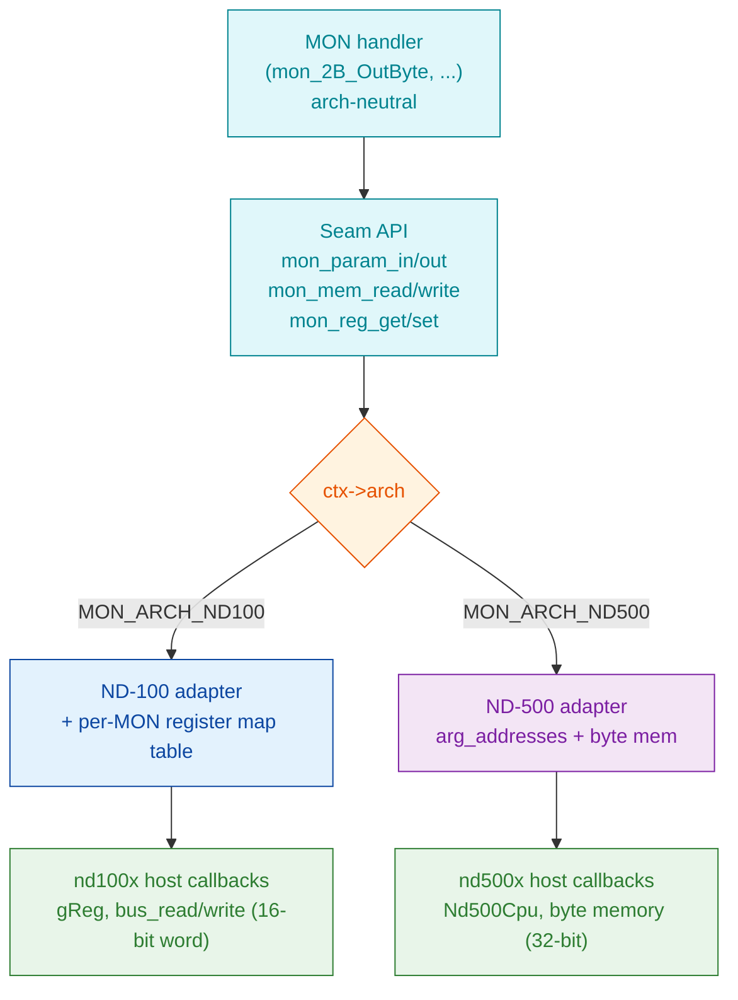

# ndmonlib Dual-Architecture Seam - Design Plan (PLAN ONLY, no code yet)

Full path: `docs/NDMONLIB_DUAL_ARCH_SEAM_PLAN.md`

Status: **DESIGN ONLY.** No ndmonlib submodule code is to be written until this
plan is approved. Author target: shared submodule `ndmonlib`, consumed by both
`/path/to/nd100x` and `<nd500x>`.

---

## 1. Goal

Make ndmonlib's MON-call handlers reusable, unchanged, across two CPU stacks
that pass MON parameters, touch memory, and return results in fundamentally
different ways:

- **ND-500** (already wired): MON via `CALL/CALLG` to segment 31. Parameters are
  a list of effective addresses; memory is byte-addressed; 32-bit words.
- **ND-100** (to add): MON via the `MON` instruction (`0153000` + 9-bit number).
  Parameters live in **registers**; memory is 16-bit word-addressed; results
  return in registers and the K flag.

The seam must abstract **three** host operations for ND-100 (per user directive):

1. **Parameter access** - read call inputs / write call outputs.
2. **Memory read/write** - with correct addressing granularity per stack.
3. **Register update/return** - read and write CPU registers directly.

Constraint: **do not replace** the existing ND-100 `interrupt(14)` MON path in
`src/cpu/cpu_instr.c` (`ndfunc_mon`). ndmonlib dispatch
is a **flag-gated alternative**, auto-enabled in the interactive shell.

---

## 2. Current state (verified from source)

### 2.1 The seam today lives in one file

`external/ndmonlib/src/core/mon_params.c`:

- `mon_read_param_word(ctx, idx)` -> `ctx->read_word(ctx->cpu, ctx->arg_addresses[idx])`
- `mon_read_param_dword` -> reads `addr` and `addr+4` (32-bit low/high) => **byte-addressed, 32-bit**
- `mon_read_param_halfword`, `mon_read_param_byte`, `mon_write_param_word`, string readers - all key off `ctx->arg_addresses[idx]`
- `mon_set_error(ctx, code)` -> `ctx->set_k_flag(ctx->cpu, 1)` (+ error code)
- `mon_set_success(ctx)` -> `ctx->set_k_flag(ctx->cpu, 0)`

Every ND-500 assumption (address-list params, byte addressing, +4 stride, K-flag
return) is concentrated here and in the handlers that call these helpers.

### 2.2 MonContext already abstracts memory + some registers

`external/ndmonlib/include/ndmon/mon_types.h`
(`struct MonContext`) already carries host callbacks:

- Memory: `read_word/write_word`, `read_halfword/write_halfword`, `read_byte/write_byte`
- Registers/flags: `set_i1`, `get_i1`, `set_k_flag`, `set_error_code`
- Args: `arg_count`, `arg_addresses[MON_MAX_ARGS]`
- Control: `halt_requested`, `break_requested`
- Registry entries already tag `nd100_compat` / `nd500_compat`.

**Gap:** parameters are hard-wired to the ND-500 address-list model in
`mon_params.c`; there is no register-based parameter marshalling, and register
access is limited to `I1` (no general A/T/X/D get/set for ND-100).

### 2.3 nd100x is NOT yet wired

- ndmonlib is present as a submodule but **not linked into nd100x's CPU**, and
  `ndfunc_mon` does not call `mon_dispatch`.
- nd500x call-site template: `<nd500x>/src/cpu/nd500_indirect.c:235`
  (builds a `MonContext`, sets callbacks, calls `mon_dispatch`).

---

## 3. Proposed seam architecture

Handlers stay architecture-neutral. All arch differences move behind a single
**host-operations interface** with two implementations (ND-100 / ND-500),
selected by a new `ctx->arch` field. No `#ifdef` in handler bodies.



### 3.1 New public seam API (handlers use ONLY these)

Add to `ndmon/mon.h` (implemented in a refactored `core/mon_params.c` that
dispatches on `ctx->arch`):

```
/* Parameters - logical, ordered as the SINTRAN manual documents them. */
uint32_t mon_param_in (MonContext* ctx, int idx);              /* read input  */
void     mon_param_out(MonContext* ctx, int idx, uint32_t v);  /* write output*/
/* Width-explicit variants where a call needs them: _byte/_half/_word/_dword. */

/* Memory - width is architecture-correct (ND-100: 16-bit word-addressed;
   ND-500: byte-addressed). Handlers state intent, adapter maps granularity. */
uint32_t mon_mem_read (MonContext* ctx, uint32_t addr, MonWidth w);
void     mon_mem_write(MonContext* ctx, uint32_t addr, uint32_t v, MonWidth w);

/* Registers - uniform names; adapter maps to g_reg[_A..] or I1.. */
uint32_t mon_reg_get(MonContext* ctx, MonReg r);
void     mon_reg_set(MonContext* ctx, MonReg r, uint32_t v);

/* Status - unchanged names, now arch-aware under the hood. */
void mon_set_error(MonContext* ctx, int32_t code);   /* ND-100: K=1 +errcode  */
void mon_set_success(MonContext* ctx);               /* ND-500: K=0            */
```

New enums: `MonArch { MON_ARCH_ND100, MON_ARCH_ND500 }`,
`MonWidth { MON_W8, MON_W16, MON_W32, MON_W64 }`,
`MonReg { MON_REG_A, MON_REG_D, MON_REG_T, MON_REG_X, MON_REG_L, MON_REG_B,
MON_REG_I1..I4, ... }`.

### 3.2 ND-100 parameter marshalling (the one genuinely new piece)

The ND-100 MON ABI passes each call's parameters in specific registers. This is
**per-MON** and must be transcribed from the SINTRAN III Monitor Calls manual
(ND-860228.2 EN) - **not guessed**. Represent it as a data table:

`external/ndmonlib/src/arch/nd100_mon_abi.c` (new):

```
typedef struct {
    uint32_t mon_number;
    uint8_t  in_count;
    MonReg   in_regs[MON_MAX_ARGS];   /* input registers, in logical order  */
    uint8_t  out_count;
    MonReg   out_regs[MON_MAX_ARGS];  /* output/return registers            */
} Nd100MonAbi;

/* EXAMPLE ROWS - VALUES TO VERIFY against ND-860228.2 before use:
   { 1 (INBT),  in:{T},   out:{A} }   // device in T, byte returned in A
   { 2 (OUTBT), in:{T,A}, out:{}  }   // device in T, byte in A
   ... all ND-100-compatible MON numbers ...
*/
```

The ND-100 adapter uses this table: before dispatch it reads `in_regs` into
`ctx->params_in[]`; after the handler returns it writes `ctx->params_out[]` to
`out_regs`. `mon_param_in/out` then just index those arrays. Rows not in the
table (ND-500-only calls) are rejected for ND-100 with a clear error.

MonContext gains: `MonArch arch;`, `uint32_t params_in[MON_MAX_ARGS];`,
`uint32_t params_out[MON_MAX_ARGS];`, plus register get/set callbacks:
`uint32_t (*get_reg)(void* cpu, int reg); void (*set_reg)(void* cpu, int reg, uint32_t);`.

### 3.3 Memory granularity

- ND-100 host callbacks map `MON_W16` to one physical word (word-addressed bus),
  `MON_W8` to a byte within a word (high/low), `MON_W32` to two consecutive words.
- ND-500 host callbacks keep today's byte-addressed behavior (`+4` stride etc.).
- The `+4` dword stride currently hard-coded in `mon_params.c` moves behind the
  adapter so ND-100 can use `+2` (word) semantics.

### 3.4 nd100x integration (host side, in nd100x - separate from ndmonlib)

New file `src/cpu/nd100_mon_glue.c`:
- `mon_read_word/halfword/byte` + `write_*` over the ND-100 bus.
- `get_reg/set_reg` over `g_reg->reg[gPIL][_A.._B]`, `set_k_flag` over STS K bit.
- `nd100_mon_build_context(MonContext* ctx, ushort mon_number)`.

`ndfunc_mon` (`src/cpu/cpu_instr.c`), flag-gated:
```
if (cpu_mon_emulation) {            /* new global, default 0 */
    MonContext ctx; nd100_mon_build_context(&ctx, monitor_number);
    mon_dispatch(&ctx);
    if (ctx.halt_requested) set_cpu_run_mode(CPU_SHUTDOWN);
    /* return; skip interrupt(14) */
} else {
    ... existing interrupt(14) path, UNCHANGED ...
}
```
Flag enabled automatically by the interactive shell (its purpose is running
BPUN/PROG without SINTRAN); `mon_init()` called once at startup;
`mon_set_unimpl_behavior(...)` gives the "unimplemented MON -> stop, don't hang"
behavior the user asked for (via `ctx.halt_requested`).

---

## 4. File-by-file change list (when approved)

ndmonlib (shared submodule):
- `include/ndmon/mon_types.h` - add `arch`, `params_in/out`, `get_reg/set_reg`, enums.
- `include/ndmon/mon.h` - add `mon_param_in/out`, `mon_mem_read/write`, `mon_reg_get/set`.
- `src/core/mon_params.c` - refactor to dispatch on `ctx->arch`; keep ND-500 path identical.
- `src/arch/nd100_mon_abi.c` (new) - per-MON register table (values from manual).
- `src/arch/nd100_marshal.c` (new) - ND-100 register<->params marshalling.
- `src/arch/nd500_marshal.c` (new) - move today's address-list logic here.
- Handlers: **only** those using raw `arg_addresses`/`+4` get switched to the new API; logic unchanged.

nd100x:
- `src/cpu/nd100_mon_glue.c` (new) + prototypes.
- `src/cpu/cpu_instr.c` `ndfunc_mon` - flag-gated dispatch.
- global `cpu_mon_emulation` + shell auto-enable + `mon_init()` at startup.
- link ndmonlib into the CPU/machine target (CMake).

nd500x:
- set `ctx.arch = MON_ARCH_ND500` at its call-site; no behavioral change.

---

## 4a. Test-binary selection (EVIDENCE - not assumed)

Traced candidate BPUNs (`--trace`, 2s window) to see what each actually issues:

| BPUN                | MON calls issued                          | I/O style               |
|---------------------|-------------------------------------------|-------------------------|
| `MAC.BPUN`          | **NONE** (0 in 37k instrs)                | IOX 400-403 paper-tape reader poll |
| `RTCLOCK-TEST.BPUN` | NONE                                      | terminal via IOX        |
| `IRW.BPUN`          | NONE                                      | none                    |
| `TWO-CHECK-1190A`   | NONE                                      | none                    |
| `DITAP-1880D.BPUN`  | 0,1,2,7,43,50,65,77,143                   | MON-based               |

**Conclusion:** `MAC.BPUN` is the STANDALONE paper-tape MAC - it reads source
from the paper-tape reader (`IOX 400/402/403`, `BSKP ONE 30` ready-poll) and
punches object out; it never uses MON/SINTRAN. It therefore **cannot validate
MON emulation** and is not a suitable MON test binary. (It IS a good future test
for IOX paper-tape device emulation - separate track.)

**Chosen test binaries for the MON subset:**
1. **Purpose-built minimal BPUN** (assemble a ~10-line source in
   `asm/`): OUTBT a short string (MON 2), INBT one char
   (MON 1), LEAVE (MON 0). Deterministic, exercises exactly the first subset,
   ideal for the integration test over a pty.
2. **`DITAP-1880D.BPUN`** as a broader real-world check once the subset works
   (adds OPEN 50 / CLOSE 43 / and MON 7,65,77,143).

Initial MON subset to implement + validate first: **0 (LEAVE), 1 (INBT),
2 (OUTBT)**, then **3 (SetEcho)**. All three already have ndmonlib handlers.

## 5. Comprehensive unit test plan

Layered so each seam boundary is tested in isolation, both arches:

1. **Marshalling adapters** (`test_mon_marshal`)
   - ND-100: given a fake register file, `mon_param_in` returns the value from
     the ABI-table register; `mon_param_out` writes the right register.
   - ND-500: given fake memory + `arg_addresses`, params resolve to addresses.
   - Memory width: `MON_W8/16/32` map to correct host accesses per arch.
   - Register get/set round-trip for A/T/X/D/L (ND-100) and I1..I4 (ND-500).
   - Error/success: K flag set/cleared per arch.

2. **ABI table integrity** (`test_mon_nd100_abi`)
   - Every `nd100_compat` MON number has a table row; counts within MON_MAX_ARGS;
     no ND-500-only call marked ND-100-runnable.

3. **Per-handler tests** (`test_mon_handlers`)
   - Each implemented handler driven through a mock MonContext for BOTH arches
     where `*_compat`; assert outputs, error codes, memory effects, console I/O.
   - INBT/OUTBT/SetEcho first (needed by MAC); then file table (OPEN/CLOSE/RW).

4. **nd100x integration** (`test_nd100_mon_glue` + pty)
   - `ndfunc_mon` with flag on: OUTBT writes a byte to the console; INBT reads;
     unimplemented MON -> `halt_requested` -> CPU stops (no hang).
   - End-to-end pty: `RUN-PROGRAM MAC.BPUN` reaches interactive prompt via
     emulated MON terminal I/O.

5. **Regression**: nd500x MON suite still green (arch=ND500 path unchanged).

CI: register all as CTest targets in ndmonlib and in each emulator.

---

## 5a. ND-500 non-regression is the GATING priority

Per explicit direction: **the ND-500 MON emulation must not break.** Rules baked
into the plan:

- The ND-500 code path (`arch == MON_ARCH_ND500`) must remain byte-for-byte
  behaviorally identical. The refactor of `mon_params.c` moves the existing
  logic verbatim into `nd500_marshal.c`; no ND-500 semantics change.
- **Gate every step on the nd500x MON regression suite** (run it BEFORE and
  AFTER each ndmonlib change; a red ND-500 test blocks the change).
- No signature change to `mon.h`/`mon_types.h` may alter existing symbols'
  behavior; only ADD fields (`arch`, `params_in/out`, `get_reg/set_reg`) and new
  functions. `arch` defaults such that an un-updated caller behaves as ND-500.
- Land ndmonlib + nd500x submodule bump + nd100x submodule bump together; do not
  merge ndmonlib alone if nd500x regression is not green.

## 6. Risks / coordination

- **Shared submodule**: ndmonlib is used by nd500x too (and coordinated with the
  RetroCore C# side). Any signature change to `mon.h`/`mon_types.h` must keep the
  ND-500 path byte-for-byte behavior. Land ndmonlib change + both superproject
  submodule bumps together; run nd500x MON regression before merge.
- **ND-100 ABI values are the long pole**: the per-MON register table must be
  transcribed from ND-860228.2 EN. Unknown rows stay absent (call rejected)
  rather than guessed.
- **Memory addressing**: ND-100 word-addressed vs ND-500 byte-addressed is the
  subtlest part; the `MonWidth` abstraction must be exercised hard in layer 1.
- **Keep the old path**: `interrupt(14)` MON must remain the default and be
  unaffected when the flag is off.

---

## 7. Suggested implementation order (post-approval)

1. Add enums + MonContext fields (no behavior change; nd500x still works).
2. Refactor `mon_params.c` to route through `nd500_marshal.c` (prove ND-500 green).
3. Add ND-100 marshalling + ABI table (INBT/OUTBT/SetEcho rows first).
4. Add nd100x glue + flag + `ndfunc_mon` dispatch; MAC I/O over pty.
5. Fill remaining ABI rows + handler tests incrementally.
